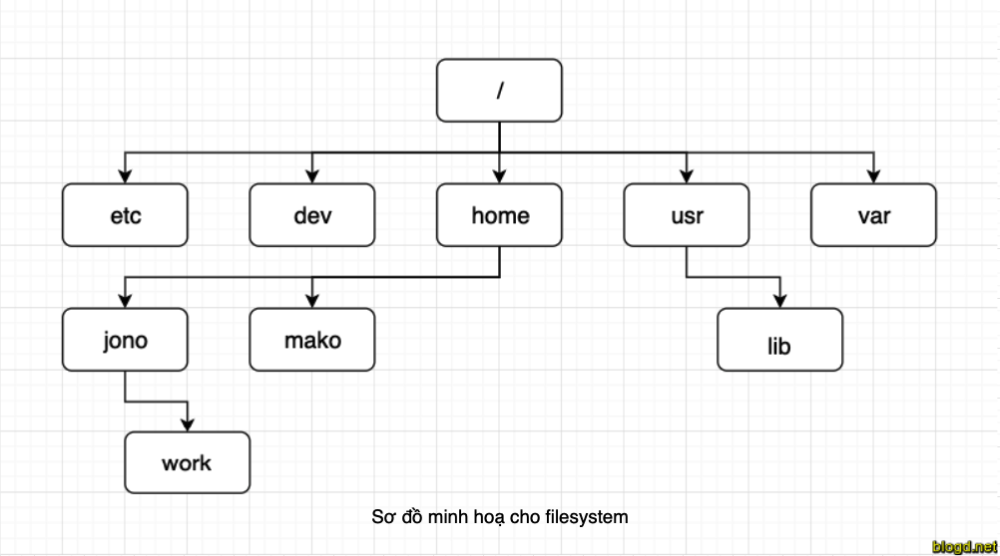
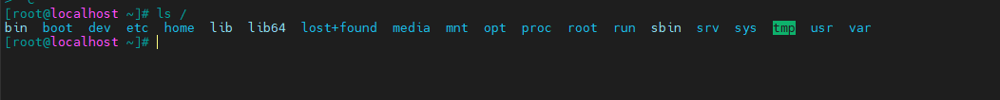
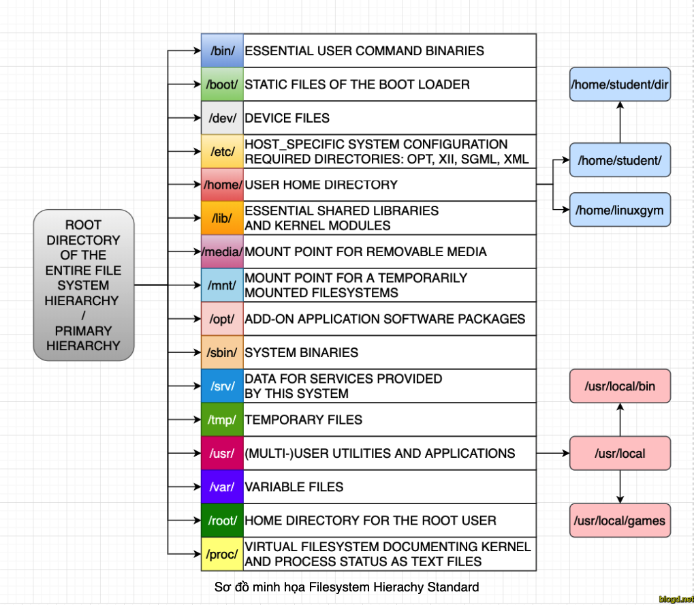

<h1 align="center">Tổng quan về filesystem trên Linux</h1>

# Phần I. File system
- FIle system được sử dụng với mục đích để quản lý cách đọc, ghi và lưu trữ dữ liệu trên thiết bị, hỗ trợ truy cập nhanh chóng khi cần thiết

<h3 align="center"></h3>

- Sự khác biệt giữa giữa 1 ổ đĩa hoặc phân vùng và hệ thống tập tin được lưu trữu trên đó là rất quan trọng. Một số chương trình(bao gồm chương trình tạo ra hệ thống tập tin) hoạt động trực tiếp trên các Sector thô của 1 ổ đĩa hay phân vùng., Nếu có 1 hệ thống tập tin tồn tại trên đó thì nó sẽ bị phá hủy hoặc hỏng hóc
- Để một phân vùng hoặc ổ đĩa có thể sử dụng như một hệ thống tập tin thì nó cần được khởi tạo và các cấu trúc dữu liệu của kiểu tập tin đó sẽ được lưu vào ổ đĩa. Đây được gọi là ` quá trình tạo hệ thống tập tin`

- Hầu hết các loại hệ thống tập tin UNIX đều có cấu trúc chung tương tự nhau, mặc dù các chi tiết cụ thể khác nhau khá nhiều. Các khái niệm chủ chốt là superblock, inode, data block, directory block và indirection block.
  - Superblock: chưa các thông tin về hệ thống tập tin một cách tổng thể, chẳng hạn như kích thước của nó (thông tin chính xác ở đây phụ thuộc vào hệ thống tập tin)
  - Inode: chứa tất cả các thông tin về một tập tin, ngoại trừ tên của nó. Tên được lưu trữ trong thư mục, cùng với số lượng lớn các inode. Mục nhập thư mục bao gồm tên tập tin và các số lượng inode đại diện cho tập tin đó. Inode chứa khối lượng lớn các khối dữ liệu, được sử dụng để lưu trữ dữ liệu trong tập tin.
  - Data block: đây là nơi dữ liệu được lưu trữ
# Phần II. Các Loại filesystem phổ biến trên Linux

Các loại filesystem được linux hỗ trợ
- Cơ bản: Minix,Ext,EXT2, EXT3, EXT4, XFS, Btrfs, JFS, NTFS,ReiserFS,Swap,..
- Filesystem dùng cho dạng lưu trữ  Flash: thẻ nhớ, usb,...
- Filesystem dành cho hệ cơ sở dữ liệu
- Filesystem mục đích đặc biệt: procfs, sysfs, tmpfs, squashfs, debugfs,…

# Phần III. Phân vùng và filesystem

Một phân vùng chưa trong đó 1 filesystem, trong một số trường hợp thì filesystem có thể mở rộng phân vùng nếu filesystem sử dụng các liên kết

Filesystem là phương pháp lưu trữ hoặc tìm kiếm tập tin trên một đĩa cứng ( trong một phân vùng)

So sánh giữa filesystem trên hệ điều hành Windows và hệ điều hành Linux:

|  | Windows | Linux |
|--------------|-------|------|
| Phân vùng | Disk1| /dev/sda1|
| Loại Filesystem | NTFS/VFAT| Minix,Ext,EXT2, EXT3, EXT4, XFS, Btrfs, JFS, NTFS,ReiserFS,Swap,..|
| Mounting Parameters | DrivelLetter| MountPoint|
| Hệ điều hành lưu trữ | C:/| /|

# Phần IV. Filesystem Hierarchy Standard (FHS)
Filesystem của linux được tổ chức theo tiêu chuẩn cấp hệ thống tập tin `Filesystem Hierarchy Standard ( FHS )`, tiêu chuẩn này định nghĩa mục đích sử dụng của từng thư mục
<h3 align="center"></h3>

nghĩa mục đích sử dụng của từng thư mục
<h3 align="center"></h3>

Các thư mục được mô tả như sau:

| Thư mục | Chức năng |
|--------------|-------|
|/bin|Các chương trình cơ bản|
|/boot|Chứa nhân Linux để khởi động và các file system maps cũng như các file khởi động giai đoạn hai.|
|/dev|Chứa các tập tin thiết bị (CDRom, HDD, FDD….).|
|/etc|Chứa các tập tin cầu hình hệ thống.|
|/home|Thư mục dành cho người dùng khác root.|
|/lib|Chứa các thư viện dùng chung cho các lệnh nằm trong /bin và /sbin. Và thư mục này cũng chứa các module của kernel.|
|/mnt hoặc /media|Mount point mặc định cho những hệ thống file kết nối bên ngoài.|
|/opt|Thư mục chứa các phần mềm cài thêm.|
|/sbin|	Các chương trình hệ thống|
|/srv|	Dữ liệu được sử dụng bởi các máy chủ lưu trữ trên hệ thống.|
|/tmp|Thư mục chứa các file tạm thời.|
|/usr|Thư mục chứa những file cố định hoặc quan trọng để phục vụ tất cả người dùng.|
|/var|Dữ liệu biến được xử lý bởi daemon. Điều này bao gồm các tệp nhật ký, hàng đợi, bộ đệm, bộ nhớ cache,…|
|/root|Các tệp cá nhân của người quản trị (root)|
|/proc|Sử dụng cho nhân Linux. Chúng được sử dụng bởi nhân để xuất dữ liệu sang không gian người dùng.|

- trên tất cả các hệ điều hành thì tên filesystem đều phân biệt chữ cái viết hoa viết thường