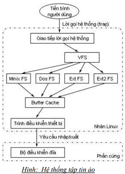

<h1 align="center">Tổng quan về filesystem trên Linux</h1>

# Phần I. File system
- FIle system được sử dụng với mục đích để quản lý cách đọc, ghi và lưu trữ dữ liệu trên thiết bị, hỗ trợ truy cập nhanh chóng khi cần thiết

<h3 align="center"></h3>

- Sự khác biệt giữa 1 ổ đĩa(phân vùng) và hệ thống tập tin được lưu trữu trên đó là rất quan trọng. Một số chương trình (bao gồm chương trình tạo ra hệ thống tập tin) hoạt động trực tiếp trên các Sector thô của 1 ổ đĩa hay phân vùng. Nếu có 1 hệ thống tập tin tồn tại trên đó thì nó sẽ bị phá hủy hoặc hỏng hóc
- Để một phân vùng hoặc ổ đĩa có thể sử dụng như một hệ thống tập tin thì nó cần được khởi tạo và các cấu trúc dữu liệu của kiểu tập tin đó sẽ được lưu vào ổ đĩa. Đây được gọi là `quá trình tạo hệ thống tập tin`

- Hầu hết các loại hệ thống tập tin UNIX đều có cấu trúc chung giống nhau, mặc dù các chi tiết cụ thể khác nhau khá nhiều. Các khái niệm chủ chốt là superblock, inode, data block, directory block và indirection block.
  - Superblock: chứa các thông tin về hệ thống tập tin một cách tổng thể, chẳng hạn như kích thước của nó (thông tin chính xác ở đây phụ thuộc vào hệ thống tập tin)
  - Inode: chứa tất cả các thông tin về một tập tin, ngoại trừ tên của nó. Tên được lưu trữ trong thư mục, cùng với số lượng lớn các inode. Mục nhập thư mục bao gồm tên tập tin và các số lượng inode đại diện cho tập tin đó. Inode chứa khối lượng lớn các khối dữ liệu, được sử dụng để lưu trữ dữ liệu trong tập tin.
  - Data block: đây là nơi dữ liệu được lưu trữ

# Phần II. Các Loại filesystem phổ biến trên Linux

Các loại filesystem được linux hỗ trợ
- Cơ bản: Minix,Ext,EXT2, EXT3, EXT4, XFS, Btrfs, JFS, NTFS,ReiserFS,Swap,..
- Filesystem dùng cho dạng lưu trữ  Flash: thẻ nhớ, usb,...
- Filesystem dành cho hệ cơ sở dữ liệu
- Filesystem mục đích đặc biệt: procfs, sysfs, tmpfs, squashfs, debugfs,…

# Phần IV. Filesystem Hierarchy Standard (FHS)
Filesystem của linux được tổ chức theo tiêu chuẩn cấp hệ thống tập tin `Filesystem Hierarchy Standard ( FHS )`, tiêu chuẩn này định nghĩa mục đích sử dụng của từng thư mục
<h3 align="center"></h3>

nghĩa mục đích sử dụng của từng thư mục
<h3 align="center"></h3>

Các thư mục được mô tả như sau:

| Thư mục | Chức năng |
|--------------|-------|
|/bin|Các chương trình cơ bản|
|/boot|Chứa nhân Linux để khởi động và các file system maps cũng như các file khởi động giai đoạn hai.|
|/dev|Chứa các tập tin thiết bị (CDRom, HDD, FDD….).|
|/etc|Chứa các tập tin cầu hình hệ thống.|
|/home|Thư mục dành cho người dùng khác root.|
|/lib|Chứa các thư viện dùng chung cho các lệnh nằm trong /bin và /sbin. Và thư mục này cũng chứa các module của kernel.|
|/mnt hoặc /media|Mount point mặc định cho những hệ thống file kết nối bên ngoài.|
|/opt|Thư mục chứa các phần mềm cài thêm.|
|/sbin|	Các chương trình hệ thống|
|/srv|	Dữ liệu được sử dụng bởi các máy chủ lưu trữ trên hệ thống.|
|/tmp|Thư mục chứa các file tạm thời.|
|/usr|Thư mục chứa những file cố định hoặc quan trọng để phục vụ tất cả người dùng.|
|/var|Dữ liệu biến được xử lý bởi daemon. Điều này bao gồm các tệp nhật ký, hàng đợi, bộ đệm, bộ nhớ cache,…|
|/root|Các tệp cá nhân của người quản trị (root)|
|/proc|Sử dụng cho nhân Linux. Chúng được sử dụng bởi nhân để xuất dữ liệu sang không gian người dùng.|

- trên tất cả các hệ điều hành thì tên filesystem đều phân biệt chữ cái viết hoa viết thường

# Phần V. Hệ thống tệp (File system – FS)
- Nhân hệ điều hành Linux có chứa một lớp hệ thống tập tin ảo (Virtual File System – VFS) được sử dụng trong suốt quá trình hệ thống gọi kích hoạt các tập tin. VFS là một lớp gián tiếp, quản lý các lời gọi hệ thống hướng tập tin và gọi những chức năng cần thiết trong mã hệ thống tập tin vật lý để thực hiện nhập/xuất.
- Cơ chế gián tiếp này được sử dụng thường xuyên trong các hệ điều hành Linux để dễ dàng hoà nhập và sử dụng nhiều kiểu hệ thống tập tin khác nhau.
- Khi một tiến trình phát sinh một lời gọi hệ thống hướng tập tin, nhân hệ điều hành gọi một chức năng được chứa trong VFS. Chức năng này quản lý các thao tác độc lập cấu trúc và chuyển hướng lời gọi tới một chức năng chứa trong mã hệ thống tập tin vật lý, nó có khả năng quản lý các thao tác phụ thuộc cấu trúc. Mã hệ thống tập tin sử dụng các chức năng trữ bộ đệm để yêu cầu nhập/xuất trên các thiết bị.
<h3 align="center"></h3>

## Cấu trúc hệ thống tập tin ảo
- VFS định nghĩa một bộ các chức năng mà mọi hệ thống tập tin phải thực thi. Giao diện này được tạo bởi một tập hợp các thao tác liên kết với ba kiểu của đối tượng:
## hệ thống tập tin, i-node, và các tập tin mở.
- VFS biết về các kiểu hệ thống tập tin được hỗ trợ trong nhân hệ điều hành. Nó sử dụng một bảng đã định nghĩa trong quá trình cấu hình nhân hệ điều hành. Mỗi mục từ trong bảng này mô tả một kiểu hệ thống tập tin: nó có chứa tên của kiểu hệ thống tập tin và một con trỏ trên một hàm đã gọi trong quá trình thao tác gắn vào (mount). Khi một hệ thống tập tin được gắn vào, hàm mount tương ứng được gọi. Chức năng này chịu trách nhiệm để đọc siêu khối (superblock) từ đĩa, khởi nạp các biến nội của nó, và trả về một bộ mô tả hệ thống tập tin được gắn vào cho VFS.
- Sau khi hệ thống tập tin được gắn vào, các hàm VFS có thể sử dụng bộ mô tả này để truy nhập hệ thống tập tin. Bộ mô tả hệ thống tập tin được gắn vào có chứa nhiều kiểu dữ liệu: kiểu dữ liệu thông tin là phổ biến với mọi kiểu hệ thống tập tin, kiểu con trỏ tới hàm được cung cấp bởi mã nhân hệ điều hành hệ thống tập tin vật lý, và dữ liệu riêng được bảo quản bởi mã hệ thống tập tin vật lý. Các con trỏ hàm có trong bộ mô tả hệ thống tập tin cho phép VFS truy nhập hệ thống tập tin.
- Hai kiểu khác của bộ mô tả được sử dụng bởi VFS: một bộ mô tả i-node và một bộ mô tả tập tin mở.

## Tổ chức logic của hệ thống tập tin Linux
**Các kiểu tập tin trong Linux**
- `Tập tin regular` là tập tin chỉ chứa dữ liệu. Dữ liệu có thể là một chương trình, một tập tin text, mã nguồn hay bất kỳ nội dung nào khác
- `Directory`: Tương tự như regular, nó chứa một bộ các byte dữ liệu, như ở đây, dữ liệu chỉ giới hạn là một danh sách các tập tin khác, đó là nội dung của thư mục. Không có giới hạn về kiểu tập tin mà một thư mục có thể chứa đựng
- `Charater device` và `block device`: Các chương trình Linux giao tiếp với các thiết bị phần cứng thông qua hai kiểu tập tin đặc biệt gọi là character device và block device. Các tập tin character device tham chiếu đến các trình điều khiển thiết bị muốn thực hiện các thao tác nhập/xuất bộ đệm như là terminal. Các tập tin block device được liên kết với các trình điều khiển thiết bị thực hiện các thao tác nhập/xuất chỉ trong phạm vi những đoạn lớn 512 hay 1024 byte và muốn nhân hệ điều hành thực hiện bộ đệm cho chúng. Một số kiểu của phần cứng như là đĩa có thể đại diện cho cả hai kiểu tập tin character device và block device.
- `Domain socket`: Được kết nối giữa các tiến trình và cho phép chúng truyền thông với nhau một cách nhanh chóng và tin cậy. Có nhiều kiểu khác nhau của domain socket, phần lớn chúng được sử dụng trong giao tiếp mạng.
- `Name pipes`: Cho phép truyền thông và giao tiếp giữa hai tiến trình không có quan hệ chạy trên cùng một máy.
- `Hard link`: Thực sự không phải là một kiểu tập tin, mà là một tập tin `liên kết` với tập tin khác. Mỗi tập tin có ít nhất một hard link. Khi một hard link mới được tạo cho một tập tin, một tên hiệu (alias) cho tập tin đó sẽ được tạo. Nội dung của hard link và tập tin nó liên kết tới luôn giống nhau. Khi thay đổi nội dung của hard link, nội dung của tập tin mà nó liên kết tới cũng thay đổi, và ngược lại.
- `Symbolic link`: Là một tập tin chỉ chứa tên của tập tin khác. Khi nhân hệ điều hành mở hoặc duyệt qua một symbolic link, nó được dẫn đến tập tin mà symbolic link chỉ đến thay vì chính bản thân của symbolic link. Sự khác nhau cơ bản giữa hard link và symbolic link là hard link là tham chiếu trực tiếp, trong khi đó symbolic link là một tham chiếu bởi tên tập tin