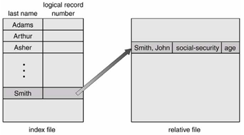

<h1 align="center">Các phương pháp truy xuất FS</h1>

# Tổng quan

Các thông tin này cần được truy xuất và đọc vào bộ nhớ máy tính để xử lý. Thông tin trong tập tin có thể được truy xuất bằng nhiều cách.

### Truy xuất tuần tự
- Phương pháp đơn giản nhất, Thông tin trong tập tin được xử lý có thứ tự
- Chế độ truy xuất này là thông dụng nhất. VD: bộ soạn thảo và biên dịch
<h3 align="center"></h3>

### Truy xuất trực tiếp

- Truy xuất trực tiếp (hay truy xuất tương đối)
- Tập tin được hình thành từ các logical records có chiều dài không đổi
- Cho phép người lập trình đọc và viết các mẫu tin nhanh chóng, không theo thứ tự
- Để truy xuất trực tiếp, tập tin được hiển thị như một chuỗi các khối hay mẫu tin được đánh số
- Phương pháp được sử dụng truy xuất tức thời lượng lớn thông tin (pp cơ sở dữ liệu).

### Các phương pháp truy xuất khác

- Được xây dựng trên cơ sở của phương pháp truy xuất trực tiếp
- Việc xây dựng chỉ mục cho tập tin. Chỉ mục chứa các con trỏ chỉ tới các khối khác
- Để tìm một mẫu tin trong tập tin - tìm chỉ mục - con trỏ để truy xuất tập tin trực tiếp và tìm mẫu tin mong muốn
<h3 align="center"></h3>