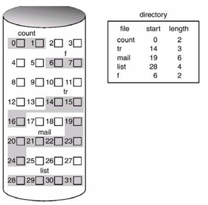
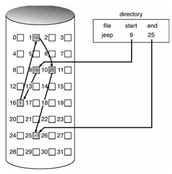
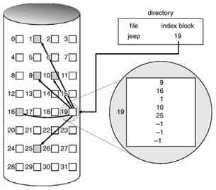
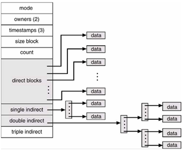

<h1 align="center">Cấp phát không gian ổ đĩa</h1>

## I. Vấn đề cấp phát không gian
- Cấp phát kề
- Liên kết
- Sử dụng chỉ mục

## II. Cấp phát kề
Cấp phát cho phép lưu trên tập hợp các khối kề trên disk. Địa chỉ được định nghĩa theo 1 thứ tự tuyến tính
- khi 1 job cần truy vấn data, nó sẽ đọc tuần tự b -> b + 1 (.. + n-1) tuần tự. Đọc lần lượt = đầu đọc di chuyển theo đĩa quay. (đầu đọc di chuyển qua từng sector trong từng cylinder và từ cylinder -> cylinder khác).
- Tối ưu tìm data dữ liệu trên ổ đĩa
- Cấp phát kế cho 1 file được xác định bới địa chỉ + chiều dài (1 = block). Nếu tệp tin cần n block => nó cấp phát từ block b => b+n-1.

**1 số vấn dề cấp phát kề:**

- Tìm không gian mới cấp phát. Sử dụng 2 chiến lược First fit và best fit
- Vấn đề khi tệp mở rộng, và cần thêm không gian => giải pháp sử dụng đoạn mở rộng.
- vấn đề về phân mảnh ổ đĩa

<h3 align="center"></h3>

## III. Cấp phát liên kết

- Giáp pháp cho vấn đề cấp phát kề.
- Mỗi tập tin lưu trên 1 danh sách liên kết, block phấn tán khắp nơi trên đĩa. Block sẽ lưu con trỏ của block tiếp theo để xác định vị trí tiếp theo
- Con trỏ size riêng theo từng block cấp phát. VD: block 512 byte => chia 4 byte con trỏ lưu 508 byte data.

- Khi tạo file mới, tạo 1 entry mới trong direct. Mỗi direct entry sẽ có con trỏ tới địa chỉ đầu tiên trên disk block file. Con trỏ khởi tạo = null nếu file rỗng, size = 0.

- Để ghi vào file rỗng, free-space management system tìm kiếm free block, new block sẽ được ghi và liên kết với end of file (cuối con trỏ rỗng vừa tạo). Để đọc file, ta đơn giản đọc block theo từng con trỏ liên kết

- không còn sự phân mảnh với cấp phát liên kết. Free block sẽ được tìm, cấp phát mỗi khi có yêu cầu. Size file không cần xác đinh trước.

**Vấn đề tồn tại trong cấp phát liên kết**

- Sử dụng hiểu cho truy xuất tuần tự. không thể truy xuất trực tiếp đến vị trí mong muốn
- Không gian cấp phát cho con trỏ, trung tình mất 0.77% disk cho lưu trữ con trỏ
- Các block liên kết thông qua con trỏ => con trỏ mất đi => mất toàn bộ dữ liệu phía. Để giải quyết sử dụng danh sách liên kết đôi.
<h3 align="center"></h3>

## IV. Cấp phát được lập chỉ mục
- Cấp phát liên kết không hỗ trợ truy xuất trực tiếp => phương pháp cấp phát chỉ mục giải quyết vấn đề này = mang tất cả con trỏ tới 1 vị trí: khối chỉ mục (index block).
- Mỗi file có khối chỉ mục riêng, 1 mảng địa chỉ. Cơ chế trên tương ứng cơ chế phân trang
- Khi file được tạo, con trỏ trong khối chỉ mục đặt = null. Khi block được ghi và thêm vào, địa chỉ block được đưa vào index-block theo thứ tự.

> - Indexed allocation (cấp phát có chỉ mục) cho phép truy cập trực tiếp, tránh phân mảnh.
> - Các khối chỉ mục được cache để tăng khả năng tìm kiếm.

** Vấn đề **
- Tiêu tốn không gian lưu chỉ mục, con trỏ lưu khối index > con trỏ cấp phát liên kết
- => cần tính toán về độ lớn mỗi khối chỉ mục.

<h3 align="center"></h3>

## V. Một số phương pháp khác

- Cơ chế liên kết (linked scheme): 1 khối chỉ mục là 1 block trên disk. Vì thế, nó có thể đọc, ghi trực tiếp. Để lưu tập tin lớn, ta có thể liên kết các khối chỉ mục.
- Chỉ mục nhiều cấp (multilevel index): 1 mở rộng của biểu diễn liên kết. Phân cấp các khối. Khối cấp 1 (gốc), sử dụng chỉ khối câp 2. Khối cấp 2 chỉ tới khối tập tin. OS sẽ truy vấn từ khối 1 để tìm khối 2 => đến data. (thức tế phân nhiều cấp hơn)
- Cơ chế kết hợp (combined scheme): Mở rộng cơ chế liên kết. Sử dụng trong quản lý Filesystem tại Linux UFS. UFS quản lý 15 con trỏ đầu tiên khối chỉ mục trong inode file. (xem thêm quản lý FS trong linux)

<h3 align="center"></h3>

