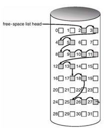

<h1 align="center">Cấp phát không gian ổ đĩa</h1>

## I. Tổng quan

- OS cần biết danh sách không gian trống để lưu trữ và quả lý. OS sử dụng 1 danh sách quản lý không gian trống. List này ghi lại tất cả khối trống.

- Khi tạo mới 1 file, OS tìm trong list không gian trống, không gian trống được chọn sẽ xóa khỏi danh sách. Hoặc khi xóa file, block xóa sẽ được đưa vào list không gian chống.

## II. Bit Vector

- Danh sách không gian trống thể hiện như 1 bản đồ bit (bit map) hoặc vector bit (bit vector). Mỗi block biểu diễn bởi 1 bit. Khối trống, bit set = 1, khối đã cấp phát set = 0).

VD: 2, 3, 4, 5, 8, 9, 10, 11, 12, 13, 17 = 00111100111 (danh sách quản lý)
PP đơn giản, nhanh chóng tìm khối trống.

## III. Danh sách liên kết
- Quản lý bộ nhớ trống = danh sách liên kết (liên kêt toàn bộ khối trống). Quản lý bằng con trỏ đầu tiên.
- Vấn đề là bắt buộc truy vấn tuần tự, tốn thời gian truy xuất, khó truy cập ngẫu nhiên.
<h3 align="center"></h3>