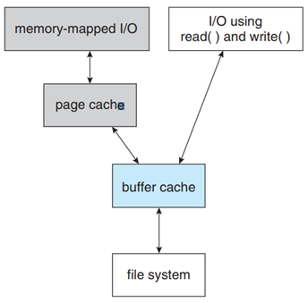
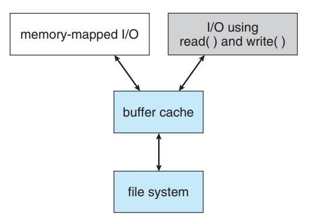

<h1 align="center">Nâng cao hiệu năng</h1>

## I. Tổng quan
- Để cải thiện hiệu năng, Disk controller thêm vào local memory nội tại để cache lại toàn bộ tracks. Khi hoạt động tìm kiếm diễn ra, track sẽ được đọc từ disk cache (giảm thời gian chờ).
- Disk controller sau đó chuyển bất kỳ sector yêu cầu tới OS. Block được chọn sẽ truyền từ disk controller vào main memory (cache OS).

## II. Kỹ thuật Cache

- Cache OS:
  - `buffer cache`: hệ thống duy trì các phần khác nhau trong memory, các block được lưu theo tần số sử dụng với thời gian ngắn
  - `Page cache`: Sử dụng kỹ thuật virtual memory, lưu lại file data như pages hơn là file-system-oriented blocks
  - caching file data sử dụng virtual address đem lại hiệu năng cao hơn so với cache physical blocks.

Các OS mới nhất thường hỗ trợ cả 2 phương pháp. Kỹ thuật được biết unified virtual memory.

- Với Unix và Linux:
  - Cung cấp kỹ thuật unified buffer cache
  - Kỹ thuật sử dụng memory mapping
  - Memory mapping sử dụng 2 loại cache - Page cache và buffer cache
  - Memory mapping thu được từ hoạt động đọc disk block bởi FS - Block sẽ được cache và buffer chace.
  - Kỹ thuật sử dụng các hàm hệ thống chuẩn read() và write()
  - Sử dụng chung trên page cache - giảm thiểu double caching, cho phép hệ thống virtual memory quản lý FS data.
> Hiện tượng double caching xảy ra khi FS data được lưu lại 2 lần.

Ví dụ về hiện tượng `double caching`
- Data được lưu tại cả Buffer và Page cache (lãng phí tài nguyên hệ thống)
<h3 align="center"></h3>
- Phương pháp unified buffer cache
<h3 align="center"></h3>

## III. Vấn đề ảnh hượng đến hiệu năng
Hoạt động đọc ghi đồng bộ và bắt đồng bộ ảnh hượng đến hiệu năng FS
  - Synchronous writes – quả trình này sẽ diễn ra trực tiếp tới disk, sẽ không được lưu lại bộ đệm
  - Ảnh hướng đến hiệu năng vì không thế nhiều hơn 1 tiến trình sử dụng
  - Các hoạt động thường thấy: Chỉnh sửa, update metadata.
  - Asynchronous write – data sẽ được cache lại để đồng bộ.
  - Hầu như hoạt động đọc ghi sử dụng kỹ thuật bất đồng bộ để nâng cao hiệu năng

## IV. Cải thiện tương tác Cache, FS, Disk driver
Khi data được ghi tới disk, page được lưu vào bộ cache. Disk driver sắp xếp đầu ra hàng đợi theo disk address. Hoạt động trên cho phép Disk driver tối ưu việc đầu đọc tìm kiếm, ghi data (vì queue tối ưu theo vòng quay).