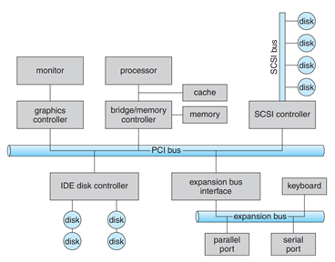
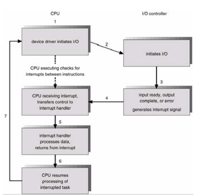
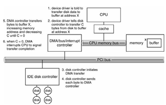

<h1 align="center">I/O Systems</h1>

## I. Tổng quan

- Một trong những vai trò quan trọng OS là quản lý hoạt động I/O - điều kiến tác vụ I/O, các thiết bị I/O, quản lý và điều khiển các thao tác nhập/xuất và các thiết bị nhập/xuất.

**Các khái niệm cơ bản**
- Kiểm soát thiết bị kết nối PC là 1 nội dung chính của OS.
- IO device gồm nhiều loại (mouse, hdd, ..)
- Phương pháp để quản lý là tạo IO subsystem trong kernel, phân tách kernel khỏi sự phức tạp IO devices
- Để tăng tính linh hoạt OS, sử dụng device drivers cung cấp các phương thức cho phép OS giao tiếp thiết bị

Các thành phần phần cứng nhập/xuất cơ bản như cổng, bus và bộ điều khiển thiết bị chứa trong một dãy rộng các thiết bị nhập/xuất.

## II. I/O Hardware
Device kết nối PC bằng cách gửi tín hiệu thông qua kết nốii có dây và không dây. Để device kết nối PC => cần có connection point hoặc port. Nếu device chia sẽ = tập dây, kết nối gọi là bus. BUS là tập dây và giao thức xác định, chỉ rõ các message có thể được gửi qua wires.

Bus thường được sử dụng trong kiến trúc PC, với tốc độ, thông lượng, phương thức kết nối khác nhau.

- `PCI bus` – kết nối vi xử lý với memory subsystem với tốc độ cao
- `expansion bus` – kết nối thiết bị chậm như keybroard User port.
- `Small Computer System Interface (SCSI)` - Kết nối tới SCSI controller
- 1 số mở rộng `PCI Express (PCIe)`, HyperTransport tốc độ từ 16-25 gb/s

**Controller** là tập các các linh kiện điện tử, hoạt động trên port, bus, device. serial-port controller is a simple device controller.

**Controller** có 1 hoặc nhiều thanh ghi cho việc lưu data, kiểm soát signal. Processor kết nối với controller băng cách đọc ghi các bit lên thanh ghi. Giao tiếp xảy ra bằng cách sử dụng các chỉ thị IO xác định, truyền các byte hoặc word tới IO port address. IO instruction kích hoạt bus lines để lựa chọn thiết bị mong muốn, chuyển bit tới device register.

<h3 align="center"></h3>

**Device controller** có thể hỗ trợ memory-mapped I/O. Trong trường hơp device-control registers được map tới không gian địa chỉ processor. CPU thực thi IO request bằng standard data-transfer instructions cho hoạt động đọc ghi device-control registers đã mapped tới vị trí physical memory.

I/O port bao gồm 4 loại thanh ghi, sử dụng thể hiện status, control, data-in, data-out
- Data-in register = sử dụng khi host nhập input
- Data-out register = đọc bởi host khi gửi kết quả
- Status register = trạng thái của cmd, lỗi, .. thể hiện bởi các bit
- Control register = ghi bởi host khi bắt đầu cmd hoặc thay đổi trạng thái device.

## III. Poling - Tìm kiếm, tham dò

- Giao thức tương tác giữa host và controller rất phức tạp, ta có thể hiểu đơn giản qua khái niệm bắt tay.
- Giả sử 2 bits dùng để thể hiện quan hệ người cung cấp, người tiêu thụ (giữa controller và host). Controller thể hiện trạng thái thông qua busy bit trong status register. Controller set trạng thái busy bit khi nó đang thực hiện công việc khác và xóa bit này khi nó sẵn sàng thực hiện.

- Host phát tín hiệu mong muốn sử dụng = command-ready bit trong command register. Host thiết lập command-ready bit khi commad có sẵn cho controller thực hiện.

- Quá trình:
  - 1. host lặp quá trình đọc busy bit cho đến khi bit ko tồn tại
  - 2. host thiết lập write bit trong command = register và ghi byte vào data-out register.
  - 3. Host thiết lập command-ready bit
  - 4. Khi controller nhận thấy command-ready bit được set, nó thiết lập busy bit
  - 5. Controller đọc command register và thấy write cmd. Nó sẽ đọc data-out register để lấy byte, thực hiện IO tới device
  - 6. Controller xóa command-ready bit, xóa error bit trong status register để chỉ ra device I/O hoàn thành, xóa busy bit thể hiện tiến trình hoàn thành

  ## IV. Ngắt

  <h3 align="center"></h3>

**Cơ chế hoạt động**:
- CPU có 1 dây dòng yêu cầu ngắt (interrup-request line) – CPU sẽ chú ý mỗi khi thực hiện 1 chỉ thị
- Khi CPU phát hiện controller gửi 1 tín hiệu trên dòng yêu cầu ngắt – CPU lưu 1 số trạng thái (con trỏ lệnh hiện hành) – nhảy tới thủ tục ngắt (interrupt-handler) đc cố định trong bộ nhớ

- Bộ quản lý ngắt xác định nguyên nhân ngắt, thực hiện xử lý cần thiết, thực thi chỉ thị return from interrupt trả về CPU trạng thái thực thi trước khi ngắt

## V. Truy xuất bộ nhớ trực tiếp (Direct memory-access-DMA)

- Đối với thiết bị có khối lượng truyền lớn như disk, nó sẽ lãng phí tài nguyên bộ xử lý để theo dõi bit trạng thái, đẩy dữ liệu vào thanh ghi theo từng byte.
- PC giảm gánh nặng cho CPU bằng chuyển 1 số công việc tới Controller có mục đích đặc biệt - bộ điều khiển truy xuất bộ nhớ trực tiếp (direct memory-access-DMA).

- Để khởi tạo thao tác chuyển DMA:
  - Máy tính tạo khối lệnh DMA vào bộ nhớ. Nó có con trỏ chỉ tới nguồn và đích chuyển, số byte được chuyển.
  - CPU ghi địa chỉ khối lệnh tới bộ điều khiển DMA, rồi tiếp tục làm việc khác.
  - Bộ điều kiển DMA xử lý để điều hành bus bộ nhớ trực tiếp, đặt các địa chỉ trên bus để thực hiện việc chuyển mà không có sự trợ giúp của CPU
  - Một bộ điều khiển DMA đơn giản là một thành phần chuẩn trong PCs, và bảng nhập/xuất bus chính (bus-mastering I/O boards) PC thường chứa phần cứng DMA tốc độ cao.

  <h3 align="center"></h3>

## VI. Vùng đệm - Buffer

Một vùng bộ nhớ lưu trữ dữ liệu tạm thời khi có hoạt động chuyển giao dữ liệu giữa hai thiết bị hay giữa thiết bị và ứng dụng.

Vùng đệm tồn tại bởi 3 lý dó:
- Đối phó với tính trạng không tương thích tốc độ giữa điểm gửi và điểm nhận
- Thích ứng giữa các thiết bị có kích thước truyền dữ liệu khác nhau (Tốc độ cao và thấp)
- Hỗ trợ ngữ nghĩa sao chép cho nhập/xuất ứng dụng.

**Vùng lưu trữ - Cache**

Là vùng bộ nhớ nhanh quản lý các bản sao dữ liệu. Truy xuất tới một bản sao được lưu trữ hiệu quả hơn truy xuất tới bản gốc

Sự khác nhau giữa vùng đệm (Buffer) và vùng lưu trữ (Cache):
- Buffer có thể giữ chỉ bản sao dữ liệu đã có
- Cache lưu trữ một bản sao trên thiết bị cho phép truy xuất nhanh, ghi nhanh (dữ liệu chưa update tới phân vùng lưu trữ).

Vùng lưu trữ và vùng đệm có chức năng khác nhau nhưng đôi khi một vùng bộ nhớ có thể được dùng cho cả hai mục đích.