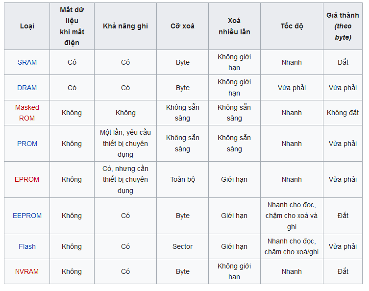

<h1 align="center">Phân loại Ram tĩnh và Ram động</h1>

## I. Ram Tĩnh

- SRAM là viết tắt của Static random-access memory hay còn gọi là ram tĩnh
- Ram tĩnh lưu dữ liệu nếu có điện, không như RAM động cần được nạp lại thường xuyên. Không nên nhầm RAM tĩnh với bộ nhớ chỉ đọc và bộ nhớ flash vì RAM tĩnh chỉ lưu được dữ liệu khi có điện.

- Ram tĩnh nhanh hơn và đắt hơn ram động nên thường được dùng bên trong CPU, ngoài ra SRAM cũng được sử dụng như bộ nhớ cache và bộ nhớ chính trong các máy chủ để có hiệu năng tốt nhất.

<h3 align="center"></h3>

## II. Ram động

- DRAM là viết tắt của Dynamic random-access memory. Đây là loại bộ nhớ được sử dụng rộng rãi trên các hệ thống máy tính và là bộ nhớ chính 

- DRAM lưu trữ mỗi bit dữ liệu trong một tụ điện riêng bên trong mạch tích hợp.Vì tụ điện bị rò điện nên nếu không được làm tươi hoặc nạp điện lại đều đặn thì các bit dữ liệu lưu trên DRAM sẽ mất dần. Đây là điểm khác biệt so với RAM tĩnh.

- Ưu điểm của DRAM là có cấu trúc đơn giản: chỉ cần một transistor và một tụ điện cho mỗi bit trong khi cần 6 transistor đối với SRAM. Điều này cho phép DRAM lưu trữ với mật độ cao. Vì DRAM mất dữ liệu khi không có điện nên nó thuộc loại thiết bị nhớ tạm thời.

