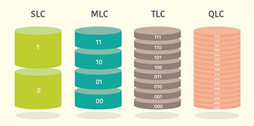
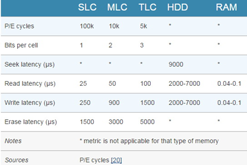
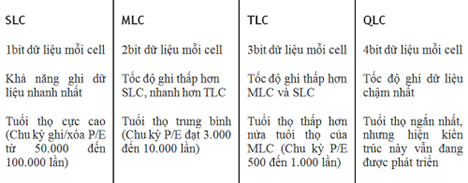

<h1 align="center">Thành phần quan trọng SSD</h1>

- Hai thành phần quan trọng quyết định hiệu suất hoạt động của SSD là flash NAND và mạch điều khiển hay còn gọi `controller`.

<h3 align="center"></h3>

- NAND SLC, MLC hay TLC

<h3 align="center"></h3>

# I. flash NAND
## 1. Giới thiệu
- Bộ nhớ Flash NAND là loại công nghệ công nghệ bộ nhớ không cần nguồn điện để duy trì dữu liệu với tốc độ đọc ghi nhanh.
- Bộ nhớ Flash NAND có khả năng xóa và ghi lại dữ liệu mới

- Cấu trúc Flash NAND được chia thành dạng lưới: Cơ bản là `cell`(ô nhớ), `page`(trang) và `block`(khối)

- Nhiều cell hợp thành một page, kích thước thường từ 2 – 16KB. Tương tự nhiều page sẽ tạo thành một block, gồm 128 đến 256 page với kích thước từ 256KB – 4MB. Trong xu hướng hiện nay, nhiều nhà sản xuất thường chọn cách mở rộng kích thước page và block để tăng tốc độ ghi của bộ nhớ.

## 2. Đặc điểm

- Các Công nghệ flash NAND phổ biến hiện nay:
  - SLC (single-level cell)
  - MLC (multi-level cell)
  - TLC (triple-level cell)

- Sự khác nhau giữa các công nghệ này là mật độ bit dữ liệu chứa trong chip nhớ, độ trễ và độ bền dựa theo chu kỳ ghi xóa (P/E cycle). Và điều này ảnh hưởng trực tiếp đến hiệu năng tổng thể của SSD.

<h3 align="center"></h3>

- SLC chỉ chứa 1 bit dữ liệu là 0 hoặc 1 những có độ trễ rất thấp và chu kỳ ghi/xóa lên đến 100.000
- MLC chứa 2 bit dữ liệu và chu kỳ ghi xóa vào khoảng 10.000 lần
- TLC chưa 3 bit dữ liệu nhưng lại có vấn đề lớn là độ tin cậy thấp, chỉ 5.000 chu kỳ P/E và độ trễ cao hơn nhiều so với hai loại trên.

> - TLC có tốc độ đọc lẫn ghi thấp hơn chip MLC
> - SSD dùng NAND SLC có hiệu năng và độ bền cao nhất đồng thời chi phí sản xuất cũng cũng đắt hơn nhiều, nên chỉ ứng dụng trong các hệ thống đòi hỏi độ bền và khả năng đáp ứng cùng lúc số lượt truy xuất dữ liệu lớn.

## 3. Ưu điểm
- Việc lưu trữ dữ liệu không biến đổi. Đối với bộ nhớ DRAM cần được cấp nguồn điện liên tục để lưu trữ dữ liệu, đối với bộ nhớ flash NAND dữu liệu vẫn được lưu trữ ngay cả khi ngắt nguồn điện nên lý tưởng cho các thiết bị lưu trữ dữ liệu xách tay và di động