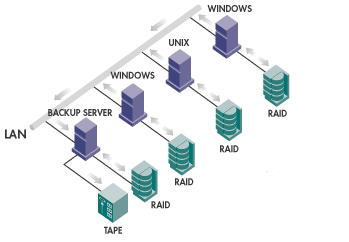
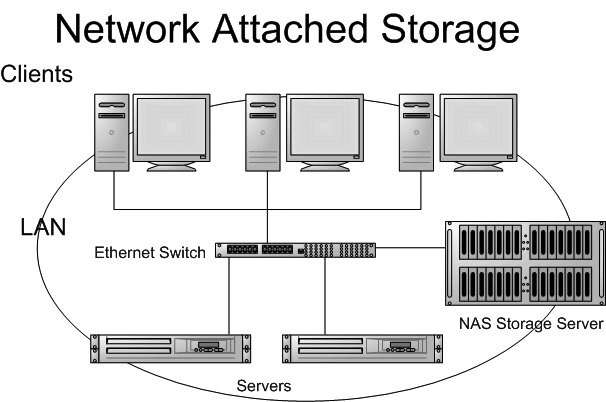
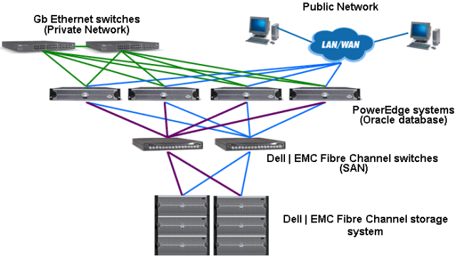
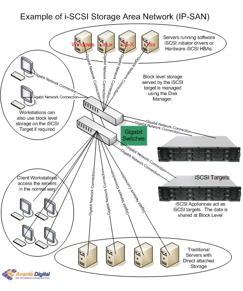

<h1 align="center">Hệ Thống Lưu Trữ DAS, NAS, SAN, ISCSI SAN</h1>

Tìm hiểu các khái niệm về Strorage (lưu trữ) để có thể lưu trữ dữ liệu của bạn một cách an toàn nhất có thể. Netsa tổng hợp cho bạn các dạng lưu trữ hệ thống lưu trữ dùng cho máy chủ ảo (VPS) hoặc máy chủ riêng (Dedicated Server) như DAS, NAS, SAN, iSCSI SAN …

## I. Direct Attached Storage (DAS)
- Direct attached storage (DAS) là cách lưu trữ mà chúng ta đã quen biết từ lâu, đó là các ổ cứng SCSI gắn bên trong các máy chủ. Các ứng dụng có thể truy cập vào ổ cứng gắn trong ở mức độ block-level hay file-level. Thích hợp cho mọi nhu cầu nhỏ đến cao cấp nhất và khả năng chạy cũng cực nhanh .
<h3 align="center"></h3>
- Một server gắn những ổ cứng HDD và SSD bên trong, 1 client và các HDD bên trong quy xuất dữ liệu trực tiếp thì đó gọi là DAS

## II. Network Atteched Storage (NAS):

- **Network attached storage** (NAS): là dạng lưu trữ dữ liệu không gắn liền với server giống như DAS mà kết nối từ xa đến server thông qua mạng LAN

- Thay vì truy cập đến thiết bị lưu trữ gắn trong (như DAS), ứng dụng truy cập đến thiết bị lưu trữ gắn trên 1 thiết bị lưu trữ khác thông qua network.Cụ thể hơn, các thiết bị NAS thường thấy chính là các server chạy hdh Windows Storage Server, được thiết kế để tối ưu cho lưu trữ, và có thể dễ dàng mở rộng dung lượng bằng cách cắm thêm thiết bị lưu trữ ngoài, hoặc combine với nhau thành group. Lúc này, ứng dụng cài trên server khác, sẽ truy cập đến thiết bị lưu trữ này (cũng là 1 server chạy Win, hoặc một HĐH nào khác) ở mức file-level, dùng CIFS (windows) hoặc NFS (unix). Các ứng dụng mà cần truy cập thiết bi lưu trữ ở mức block-level sẽ không thể truy cập vào NAS device (vd: exchange server); trong khi đó Lotus Note hoạt động ở mức file-level nên dùng NAS được.
<h3 align="center"></h3>
- Bạn cũng có thể hiểu rằng NAS chính là DAS được đặt trên mạng IP mà các Server/Client truy xuất từ xa đến nó.

## III. Storage Area Network (SAN)

- Storage area network (SAN) hiện có 2 loại chính dùng 2 kiểu protocol khác nhau, là Fiber Channel và iSCSI.

<h3 align="center"></h3>

- Nếu như NAS không thể thay thế DAS vì chỉ ở mức file-level access, thì SAN thay thế được DAS vì nó hỗ trợ block-level access, và là phương án mở rộng cho DAS. Nếu như SCSI là cách truy cập vào DAS, thì iSCSI mở rộng khả năng của SCSI ra các hệ thống lưu trữ nằm ở xa server (internet SCSI), cũng vẫn là SCSI nhưng lần này là hoạt động ở môi trường IP của LAN hoặc Internet. Như vậy, ứng dụng với sự hỗ trợ của iSCSI có thể truy cập và sử dụng 1 ổ cứng SCSI ở xa như thể ổ cứng đó đang gắn trực tiếp bên trong.

- Chi phí triển khai hệ thống SAN là khá đắt, nó đòi hỏi phải dùng các thiết bị Fiber Chennel Networking, Fiber Channel Swich,…

- Các ổ đĩa chạy trong hệ thống lưu trữ SAN thường được dùng : FIBRE CHANNEL , SAS , SATA,…

### **Tính năng**
- Lưu trữ được truy cập theo block qua SCSI
- Khả năng I/O với tốc độ cao
- Tách biệt thiết bị lưu trữ và server

### **Lợi ích khi sử dụng SAN**
- Dễ dàng chia sẻ lưu trữ và quản lý thông tin
- Mở rộng lưu trữ dễ dàng thông qua quá trình thêm các thiết bị lưu trữ vào mạng — Không cần phải thay đổi các thiết bị như máy chủ hay các thiết bị lưu trữ hiện có.
- Cho phép nhiều máy chủ cùng chia sẻ một thiết bị lưu trữ.
- Cho phép thay đổi hay nâng cấp máy chủ một cách dễ dàng và dữ liệu không hề ảnh hưởng khi máy chủ bị lỗi.

## IV. iSCSI SAN

- iSCSI là Internet SCSI ( Small Computer System Interface ) là một chuẩn công nghiệp phát triển để cho phép truyền tải các lệnh SCSI qua mạng IP hiện có bằng cách sử dụng giao thức TCP/IP.

<h3 align="center"></h3>

- Các thiết bị iSCSI SAN (hay IP SAN) là các Server (chạy HĐH nào đó, Win Storage chẳng hạn) và có cài tính năng hỗ trợ iSCSI ở phía server (gọi là iSCSI target). Các máy truy cập đến thiết bị IP SAN bằng iSCSI sẽ phải hỗ trợ tính năng iSCSI client (gọi là iSCSI source). iSCSI source (client) được cài sẵn trong Win Vista/7 và 2008. Đối với iSCSI target, có nhiều Soft, ví dụ StarWind trên nền Win, và OpenFiler trên nền Linux.

- iSCSI dễ dùng, linh hoạt, dễ mở rộng, vì hoạt động dựa trên nền IP và Ethernet / Internet, không đòi hỏi phần cứng đặc biệt. Đặc biệt hiệu quả khi mạng Ethernet 10G phổ biến.

- Nếu như giao thức iSCSI hoạt động trên nền IP, và từ lớp Internet trở lên, thì giao thức Fiber Channel (1 loại SAN khác) hoạt động ở mức Physical layer, nên phụ thuộc nhiều vào phần cứng, cần đến phần cứng riêng biệt, bao gồm các Switch, NIC (HBA) và thiết bị lưu trữ/cáp hỗ trợ Fiber channel. Vì không hoạt động trên nền IP nên không linh động và khó mở rộng, so với IP SAN. Dù khó dùng và đắt tiền, Fiber Channel SAN đã và đang là giải pháp SAN chính của nhiều hệ thống lớn.