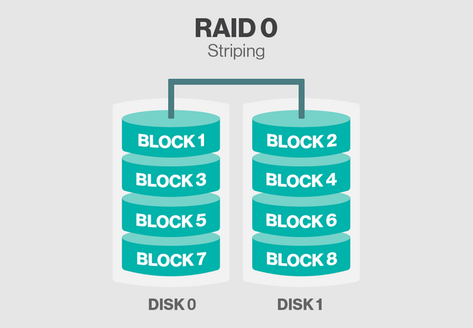
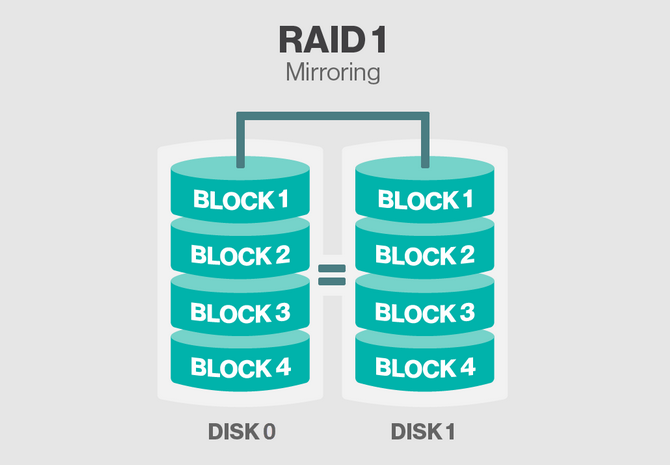
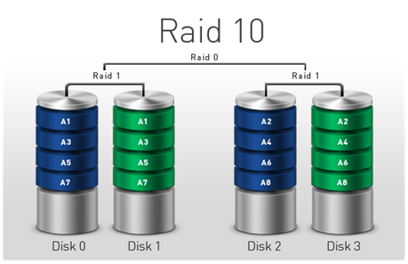
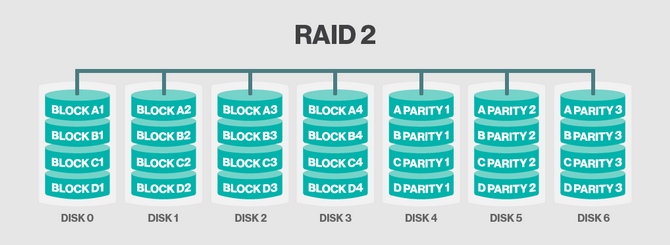
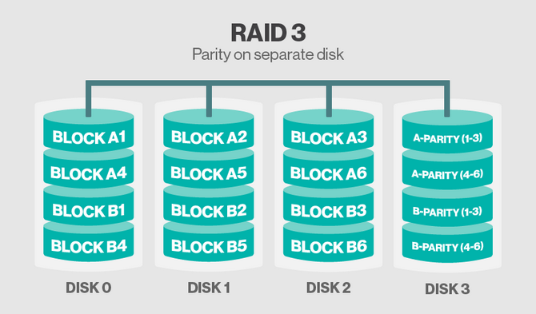
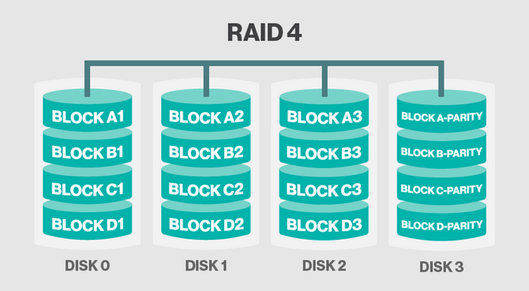
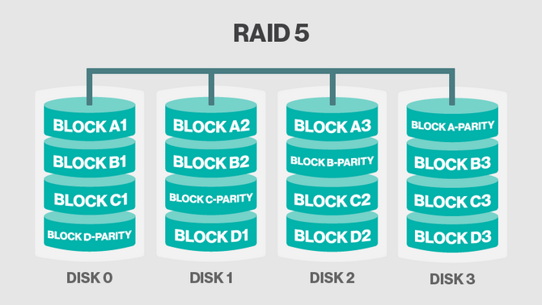
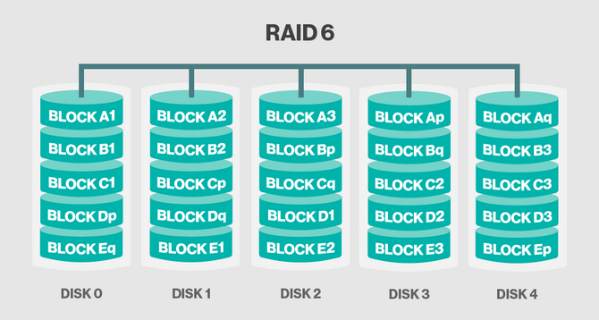

<h1 align="center">Tổng quan về Raid</h1>

# I. Tìm hiều về Raid
- RAID là viết tắt của Redundant Array of Inexpensive Disks (Hệ thống đĩa dự phòng).

- Đây là hệ thống hoạt động bằng cách kết nối một dãy các ổ cứng có chi phí thấp lại với nhau để hình thành một thiết bị nhớ đơn có dung lượng lớn hỗ trợ hiệu quả cao và đáng tin cậy.

- RAID được sử dụng và triển khai thành phương pháp lưu trữ trong doanh nghiệp và các máy chủ, nhưng trong 5 năm sau đó RAID đã trở nên phổ biến đối với mọi người dùng.

**Lợi thế của RAID**
- Có 3 lý do chính để áp dụng RAID:
  - Dự phòng
  - Hiệu quả cao
  - Giá thành thấp

- Sự dự phòng là nhân tố quan trọng nhất trong RAID. Cho phép sao lưu dữ liệu bộ nhớ khi gặp sự cố. Nếu một ổ cứng trong dãy bị trục trặc thì có thể thay thế sang ổ cứng khác mà không cần tắt cả hệ thống. Phương pháp dự phòng phụ thuộc vào phiên bản RAID được sử dụng.
- Khi áp dụng các phiên bản RAID mạnh, hiệu năng có thể tăng cao. Hiệu quả cũng tùy thuộc vào số lượng ổ cứng được liên kết với nhau và các mạch điều khiển.

# II. Nên chọn cấp độ RAID nào cho phù hợp?

Có nhiều cấp độ RAID khác nhau, và cấp độ mà bạn chọn phụ thuộc vào việc bạn dùng RAID để tăng hiệu suất hay khả năng chịu lỗi (hoặc cả hai). Việc bạn sử dụng RAID cứng hay RAID mềm cũng là vấn đề, bởi vì phần mềm hỗ trợ ít cấp độ hơn so với RAID dựa trên phần cứng. Trong trường hợp RAID cứng, chủng loại bộ điều khiển lại cũng là vấn đề. Nhiều bộ điều khiển khác nhau hỗ trợ các cấp độ RAID khác nhau và có thể quy định loại ổ đĩa bạn có thể dùng trong một mảng: HDD hay SSD, hỗ trợ chuẩn giao tiếp SCSI, SAS hay SATA...

## 1. RAID 0
- Được sử dụng để tăng hiệu suất của máy chủ, còn được gọi là "disk striping" (ổ đĩa sọc). Với RAID 0, dữ liệu được stripe (chia sọc) trên nhiều đĩa (tối thiểu là 2). Điều này nghĩa là công việc mà máy tính đang thực hiện được xử lý bởi nhiều ổ đĩa chứ không phải chỉ có một, giúp tăng tốc độ đọc ghi dữ liệu. RAID mềm và RAID cứng, cũng như hầu hết bộ điều khiển đều hỗ trợ cấp độ này.
<h3 align="center"></h3>

- Raid 0 là loại Raid khá phổ biến, bởi có khả năng nâng cao hiệu suất tốc độc đọc ghi trao đổi dữ liệu của ổ cứng. Để tiến hành setup Raid 0 thì cần tối thiểu 2 ổ đĩa (Disk 0, Disk 1).

- Cách lưu trữ dữ liệu: Có 1 file A dung lượng 100MB. Khi tiến hành lưu trữ thay vì file A sẽ được lưu vào 1 ổ cứng duy nhất, Raid 0 sẽ lưu vào 2 ổ đĩa disk 0, disk 1 mỗi ổ 50MB (Striping), giảm thời gian đọc ghi xuống 1 nửa theo lý thuyết.

**Ưu điểm:**
- Tốc độ đọc ghi nhanh (gấp đôi bình thường theo lý thuyết).

**Nhược điểm:**
- Tiềm ẩn rủi ro về dữ liệu. Lý do dữ liệu được chia đôi lưu trên 2 ổ đĩa.Trường hợp 1 trong 2 ổ đĩa bị hỏng thì nguy cơ mất dữ liệu rất cao. Về ổ cứng yêu cầu phải 2 ổ cùng dung lượng, nếu 2 ổ khác dung lượng thì lấy ổ thấp nhất.

**Đối tượng sử dụng:**
- Thích hợp với những dịch vụ cần lưu trữ và truy xuất với tốc độ cao. Chẳng hạn như dịch vụ video streaming, chạy cơ sở dữ liệu.

## 2. RAID 1
- Là loại cấu hình có khả năng chịu lỗi, còn được gọi là "disk mirroring" (ổ đĩa gương). Với RAID 1, dữ liệu được mirror (sao chép) liên tục và đồng thời, từ đĩa này sang đĩa khác, tạo nên một bản sao hay còn gọi là gương. Nếu một ổ đĩa bị hỏng, ổ kia vẫn có thể tiếp tục hoạt động. Đây là cách đơn giản nhất để tạo khả năng chịu lỗi và chi phí tương đối thấp.

<h3 align="center"></h3>

- Raid 1 là loại Raid cơ bản. Tăng độ an toàn về dữ liệu. Tiến hành setup Raid 1 cần tối thiểu 2 ổ cứng để lưu trữ.
- Raid 1 đảm bảo an toàn dữ liệu do dữ liệu được ghi vào 2 ổ giống hệt nhau (Mirroring).
**Ưu điểm:**
- An toàn về dữ liệu, trường hợp 1 trong 2 ổ đĩa bị hỏng thì dữ liệu vẫn có khả năng đáp ứng dịch vụ.

**Nhược điểm:**
- Hiệu suất không cao, Nâng cao chi phí (giả sử khách hàng sử dụng 2 ổ cứng 500GB. Khi sử dụng Raid 1 thì dung lượng lưu trữ có thể sử dụng chỉ được 500GB). Về ổ cứng yêu cầu phải 2 ổ cùng dung lượng, nếu 2 ổ khác dung lượng thì lấy ổ thấp nhất.

**Đối tượng sử dụng:**
- Các dịch vụ lưu trữ, các website vừa và nhỏ không yêu cầu quá cao về tốc độ đọc ghi (in/out) của ổ cứng. Các đối tượng yêu cầu sự an toàn về dữ liệu như các dịch vụ kế toán,lưu trữ thông tin khách hàng, bất động sản v.v…

## 3. RAID 10

<h3 align="center"></h3>

- Raid 10 là sự kết hợp giữa 2 loại raid phổ biến và Raid 1 và Raid 0. Để setup Raid 10 cần sử dụng tối thiểu 4 ổ cứng (Disk 0, Disk 1, Disk 2, Disk 3).
- Dữ liệu sẽ được lưu đồng thời vào 4 ổ cứng. 2 ổ dạng Striping (Raid 0) và 2 ổ (Mirroring) Raid 1.

**Ưu điểm:**
- Đây là 1 hình thức lưu trữ nhanh nhẹn và an toàn, vừa nâng cao hiệu suất mà lại đảm bảo dữ liệu không bị thất thoát khi 1 trong số 4 ổ cứng bị hỏng.

**Nhược điểm:**
- Chi phí cao. Đối với Raid 10 dung lượng sẵn sàng sử dụng chỉ bằng ½ dung lượng của 4 ổ. (giống như raid 1).

**Đối tượng sử dụng:**
- Raid 10 thích hợp với tất cả các đối tượng sử dụng (từ những yêu cầu về hiệu suất đến việc đảm bảo an toàn dữ liệu). Về ổ cứng yêu cầu phải 4 ổ cùng dung lượng, nếu 4 ổ khác dung lượng thì lấy ổ thấp nhất.

## 3. RAID 2

- Là cấp độ RAID duy nhất không sử dụng một hoặc nhiều kỹ thuật "tiêu chuẩn" như mirror, stripe và/hoặc parity (tính chẵn lẻ - là dữ liệu bổ sung được sử dụng cho việc khôi phục). RAID 2 sử dụng một thứ tương tự như stripe có parity, nhưng không giống như cách được dùng trong các cấp độ RAID 3, 4, 5, 6, 7.

<h3 align="center"></h3>

- Dữ liệu của RAID 2 được stripe ở cấp độ bit, phân bố qua nhiều ổ đĩa dữ liệu và ổ đĩa dự phòng. Các bit dự phòng được tính toán bằng mã Hamming, một dạng Mã Sửa Lỗi (ECC - Error Correcting Code hoặc Error Checking & Correcting). Khi có hoạt động stripe dữ liệu, những mã này được tính toán và ghi cùng với dữ liệu lưu vào ổ đĩa ECC riêng biệt. Khi có hoạt động đọc dữ liệu, những mã ECC cũng được đọc để xác nhận rằng không có lỗi xảy ra kể từ lúc ghi dữ liệu. Nếu một lỗi đơn xảy ra, nó sẽ được sửa ngay tức thì. Cấp độ này có khả năng chịu lỗi một ổ đĩa.

- RAID 2 đòi hỏi một bộ điều khiển phức tạp, chuyên dụng và đắt tiền. Loại RAID này hiếm khi được sử dụng bởi chi phí triển khai quá lớn (một hệ thống điển hình yêu cầu đến 10 ổ đĩa dữ liệu, 4 ổ đĩa ECC), và có hiệu suất không cao (do stripe ở cấp độ bit).

## 4. RAID 3

- Dữ liệu được stripe qua nhiều ổ đĩa ở cấp độ byte; số lượng byte của mỗi stripe có thể thay đổi nhưng thông thường dưới 1.024 byte (tức 1KB). Parity được tính toán và lưu vào một ổ đĩa riêng biệt, nhưng có khả năng chịu lỗi khi sự cố xảy ra với một ổ đĩa bất kỳ. Nếu một ổ đĩa bị lỗi hoặc không thể khởi động, dữ liệu ban đầu sẽ được tái tạo từ những dữ liệu đã stripe và ổ đĩa parity này - diễn ra liên tục và hoàn toàn tự động. Về cơ bản, hệ thống vẫn hoạt động ngay cả khi một ổ đĩa bị chết và đến khi bạn thay thế ổ đĩa hỏng đó.

<h3 align="center"></h3>

- Ổ đĩa parity trong RAID 3 gây nên tình trạng nghẽn cổ chai khiến hiệu suất không cao, đặc biệt trong hoạt động ghi ngẫu nhiên, bởi vì nó phải được truy cập liên tục khi có dữ liệu được ghi. Điều này trái ngược với RAID 5, cải thiện hiệu suất ghi bằng cách phân bố parity trên tất cả ổ đĩa (mặc dù loại RAID này cũng phải chịu ảnh hưởng bởi hoạt động ghi, sẽ được đề cập sau).

- RAID 3 có tốc độ đọc ghi tuần tự khá tốt, nhưng lại hạn chế về tốc độ đọc ngẫu nhiên (do stripe ở cấp độ byte) và tốc độ ghi ngẫu nhiên (do dùng ổ đĩa parity riêng biệt). Vì vậy RAID 3 ít khi được sử dụng, ngoại trừ các ứng dụng có dung lượng tập tin lớn, đòi hỏi tốc độ truy xuất tuần tự cao và yêu cầu ổ đĩa dự phòng, chẳng hạn như xử lý các video nguyên bản (không nén).

- Loại RAID này yêu cầu tối thiểu ba ổ đĩa và có dung lượng được tính như sau: (dung lượng của ổ đĩa nhỏ nhất) x (số lượng ổ đĩa - 1).

- Ví dụ: Nếu máy chủ có bốn ổ đĩa 1TB được cấu hình RAID 3, khi đó tổng dung lượng lưu trữ trong mảng sẽ là 1TB x (4 - 1) = 3TB.

## 5. RAID 4

- Nhiều người đôi khi nhầm lẫn loại này với RAID 3. RAID 4 cải thiện hiệu suất bằng cách stripe dữ liệu qua nhiều ổ đĩa theo khối và có khả năng chịu lỗi thông qua ổ đĩa parity riêng biệt. Điều này làm cho RAID 4 giống như "anh em ruột" với RAID 3 và RAID 5 do có những điểm tương đồng. Nó giống RAID 3 ngoại trừ việc sử dụng các khối thay vì các byte khi phân bố dữ liệu, và giống RAID 5 ngoại trừ việc sử dụng ổ đĩa parity riêng biệt thay vì phân bố parity.

<h3 align="center"></h3>

- So với RAID 3, stripe của RAID 4 được cải tiến từ byte sang block, giúp cải thiện hiệu suất truy cập ngẫu nhiên, nhưng việc dùng ổ đĩa parity giống nhau nên vẫn bị tình trạng nghẽn cổ chai, đặc biệt trong hoạt động ghi ngẫu nhiên.

- RAID 4 yêu cầu số lượng ổ đĩa tối thiểu, dung lượng lưu trữ, khả năng chịu lỗi và các thuộc tính khác cũng tương tự như RAID 3 và RAID 5.

## 6. RAID 5
<h3 align="center"></h3>

- Nguyên tắc của Raid 5 gần giống với 2 loại raid lưu trữ truyền thống là Raid 1 và Raid 0. Tách ra lưu trữ các ổ cứng riêng biệt và có phương án dự phòng khi có sự cố phát sinh đối với 1 ổ cứng bất kì trong cụm.
- Setup Raid 5 cần tối thiểu 3 ổ cứng. Giả sử có 1 file A thì khi lưu trữ sẽ tách ra 3 phần A1, A2, A3. Ba phần nãy sẽ tương ứng lưu trên ổ đĩa Disk 0, Disk 1, Disk 2, còn ổ đĩa Disk 3 sẽ giữ bản sao lưu backup của 3 phần này. Tương tự các file sau cũng vậy và tùy theo tiến trình thực hiện mà bản sao lưu có thể được lưu ở bất kì 1 trong những ổ trong cụm Raid.

**Ưu điểm:**
- Nâng cao hiệu suất, an toàn dữ liệu, tiết kiệm chi phí hơn so với hình thức lưu trữ Raid 10.

**Nhược điểm:**
- Chi phí phát sinh thêm 1 ổ so với hình thức lưu trữ thông thường. (tổng dung lượng ổ cứng sau cùng sẽ bằng tổng dung lượng đĩa sử dụng trừ đi 1 ổ. Giả sử bạn có 4 ổ 500GB thì dung lượng sử dụng sau cùng khi triển khai Raid 5 bạn chỉ còn 1500GB).

**Đối tượng sử dụng:**
- Tất cả những website, dịch vụ, ứng dụng có số lượng truy cập và yêu cầu tài nguyên từ nhỏ đến vừa và lớn.

## 7. RAID 6
<h3 align="center"></h3>

- Mở rộng, và tương tự RAID 5. Lặp lại nhiều hơn số lần sự phân tách dữ liệu để ghi vào các đĩa cứng khác nhau RAID 6 yêu cầu tối thiểu 4 ổ cứng.

**Ưu điểm:**
- Nâng cao hiệu suất, an toàn dữ liệu, tiết kiệm chi phí hơn so với hình thức lưu trữ Raid 10.

**Nhược điểm:**
- Chi phí phát sinh sẽ cao hơn RAID 5.

## 8. RAID 7

- Khác với những RAID trên, RAID 7 không phải là một chuẩn công nghiệp; nó là thuật ngữ thương mại của Storage Computer Corporation (SCC), được dùng để miêu tả cho thiết kế RAID độc quyền của họ.

- RAID 7 dựa trên RAID 3 và RAID 4, nhưng được cải tiến để khắc phục một số hạn chế của hai loại RAID này. RAID 7 kết hợp một bộ nhớ cache được sắp xếp theo nhiều cấp và một bộ xử lý thời gian thực (real-time) chuyên dụng để quản lý mảng theo kiểu bất đồng bộ. Với việc sử dụng truy cập bất đồng bộ, RAID 7 phá vỡ kiến trúc kỹ thuật trước đây của RAID chuẩn, giảm đáng kể tình trạng nghẽn cổ chai trong quá trình ghi dữ liệu.

<h3 align="center"></h3>

- Nhờ sự hỗ trợ của phần cứng - đặc biệt là bộ nhớ cache - cho phép mảng RAID 7 xử lý nhiều hoạt động cùng một lúc, giúp cải thiện đáng kể hiệu suất trong khi vẫn duy trì khả năng chịu lỗi. Cụ thể, RAID 7 cung cấp tốc độ đọc và ghi ngẫu nhiên tốt hơn nhiều so với RAID 3 hoặc RAID 4, bởi khi có phần cứng hỗ trợ, hoạt động đọc truy xuất dữ liệu từ bộ nhớ cache thay vì truy cập các ổ đĩa trong mảng, còn hoạt động ghi giảm bớt sự lệ thuộc vào ổ đĩa parity riêng biệt.

- Với hiệu suất tăng cao của RAID 7, tất nhiên cái giá phải trả không hề nhỏ. Ngoài chi phí mua thiết bị chuyên dụng, khách hàng phải tốn thêm khoản phí bản quyền cho SCC. RAID 7 chỉ thích hợp với những doanh nghiệp, tổ chức lớn, có yêu cầu công việc hết sức đặc biệt. Đây là một giải pháp đắt tiền, chỉ được triển khai và hỗ trợ bởi một công ty duy nhất.

## 8. JBOD

- JBOD (Just a Bunch Of Disks) thực tế không phải là một dạng RAID chính thống, nhưng lại có một số đặc điểm liên quan tới RAID và được đa số các thiết bị điều khiển RAID hỗ trợ. JBOD cho phép bạn gắn bao nhiêu ổ đĩa tùy thích vào bộ điều khiển RAID của mình (dĩ nhiên là trong giới hạn cổng cho phép). Sau đó chúng sẽ được "tổng hợp" lại thành một đĩa cứng lớn hơn cho hệ thống sử dụng. Ví dụ bạn cắm vào đó các ổ 10GB, 20GB, 30GB thì thông qua bộ điều khiển RAID có hỗ trợ JBOD, máy tính sẽ nhận ra một ổ đĩa 60GB. Tuy nhiên, lưu ý là JBOD không hề đem lại bất cứ một giá trị phụ trội nào khác: không cải thiện về hiệu năng, không mang lại giải pháp an toàn dữ liệu, chỉ là kết nối và tổng hợp dung lượng mà thôi.