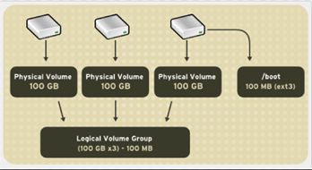
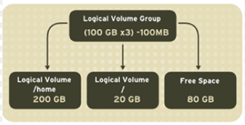
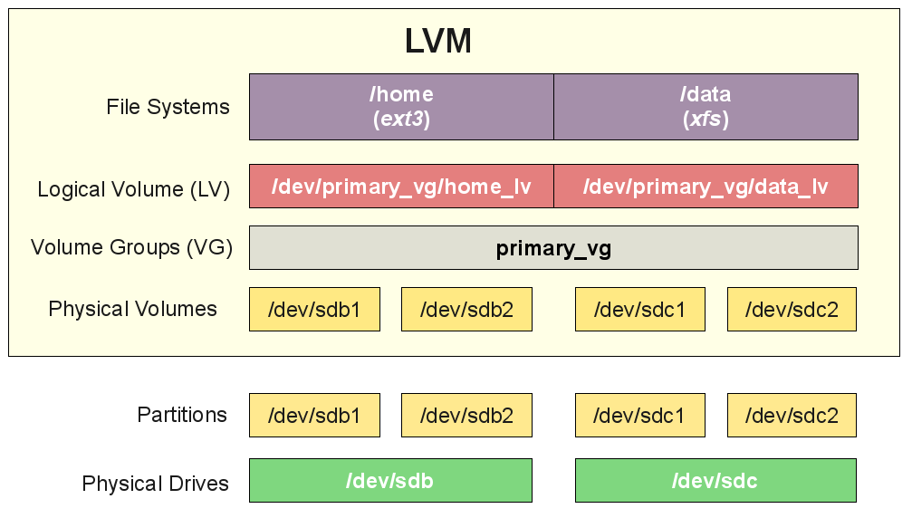

<h1 align="center">Tổng quan về LVMI</h1>

# I. Giới thiệu

- **`LVM`** là một phương pháp cho phép ấn định không gian đĩa cứng thành những Logical Volume => khiến cho việc thay đổi kích thước trở nên dễ dàng (so với partition)

- Có thể thay đổi kích thước má không cần thay đổi partition table của OS. Hữu ích khi sử dụng hết bộ nhớ trống và muốn mở rộng.

> Chỉ cần thực hiện ấn định lại dung lượng mà không cần  phải phân vùng lại.
## 1.1 Khái niệm
- **`Logical Volume Manager`** là một công cụ hỗ trợ quản lý thay đổi kích thước lưu trữ ổ cứng.. Làm phương pháp ấn định không gian ổ đĩa thành các logicalvolume khiến cho việc thay đổi kích thước các phân vùng trở nên dễ dàng hơn. Điều này thuận tiện trong việc quản lý các phân vùng ổ đĩa

- Một số khái niệm liên quan:
  - Physical volume: là một đĩa cứng vật lý hoặc là partition
  - Volume group: là một nhóm các physical volume ( ổ đĩa ảo )
  - logical volume: là các phân vùng ảo của ổ đĩa ảo

- Một số câu lệnh cần thiết:
  - Lệnh Fdisk: Sử dụng để quản lý các phân vùng ổ cứng. Tìm hiểu thêm [Tại đây](https://blogd.net/linux/quan-ly-phan-vung-dia-cung-tren-linux/)
  - Lệnh Mount: Sử dụng để gắn 1 phân vùng vào 1 thư mục chỉ định đã được tạo sẵn. Tìm hiểu thêm [Tại đây](https://blogd.net/linux/mount-tap-tin-iso-trong-linux/) 
  - Lệnh dd: Dùng Sao lưu và hồi phục toàn bộ dữ liệu ổ cứng hoặc một partition và kiểm tra tốc độ đọc của kiểu lưu trữ dữ liệu trong LVM
- LVM hỗ trợ quản lý thay đổi kích thước lưu trữ ổ cứng

- **Mục tiêu**:
  - Không để hệ thống bị gián đoạn khi đang hoạt động
  - Không làm lỗi dịch vụ đang chạy
  - Có thể kết hợp Hot Swapping (thao tác thay thế nóng các thành phần bên trong máy tính)
  - Dễ dàng thay đổi kích thước phân vùng và thư mục khi cần thiết
  - Sao lưu nhất quán bằng cách tạo Spanshot nhanh các khối một cách hợp lý
  - Mã hóa nhiều phân vùng vật lý bằng một mật khẩu

# III. Một số thuật ngữ trong LVM

- Ổ cứng: là một thiết bị lưu trữ dữ liệu máy tính. Là loại bộ nhớ không thay đổi và mất dữ liệu khi ngừng cung cấp nguồn điện
- Partition: là các phân vùng của ổ cứng. Mỗi ổ cứng có 4 Partition, bao gồm 2 loại: primary partition và extended partition
  - primary partition: còn được gọi là phân vùng chính, có thể khởi động và mỗi ổ cứng chỉ có tối đa 4 phân vùng này
  - extended partition: Hay còn được gọi là phân vùng mở rộng của ổ cứng

- Cách thức hoạt động các tầng của LVM:
  - Tầng đầu tiên: hard drivres là tầng mà các disk ban đầu chưa được phân vùng
  - Partitions: Từ 1 disk chia ra thành các phân vùng nhỏ hơn
  - Physical volume : từ một partitions ta sẽ tạo ra được một physical
  - group volume : Ta sẽ ghép nhiều physical volume thành một group volume
  - Logical volume: Từ Group volume ta tạo ra được Logical volume
  
## 3.1 Physical volumes (PV):
- Đĩa cứng vật lý trong server
- Có thể kết hợp nhiều PV để tạo thành một Volume Groups với dung lượng bằng tổng dung lượng các PV
- PV chỉ là đại diện cho các ổ đĩa vật lý chứ không phải là bản thân ổ đĩa đó, vì vậy để cần phải tạo PV từ các dev đã mount.

## 3.2 Volume Groups (VG)
<h3 align="center"></h3>

- Một tập hợp các PV, từ VG sẽ có thể phân chia thành các Logical Volumes và các Logical Volumes này có thể thay đổi kích thước dễ dàng.

## 3.3 Logical Volumes (LV)

<h3 align="center"></h3>

- Đơn vị cuối cùng của hệ thống LVM, các LV tương đương với partition theo cách phân chia truyền thống
- LV có thể thay đổi kích thước dễ dàng, tất cả chỉ phụ thuộc vào kích thước của VG.

## 3.4 File Systems (FS)

- Tổ chức và kiểm soát các tập tin
- Được lưu trữ trên ổ đĩa cho phép truy cập nhanh chóng và an toàn
- Sắp xếp dữ liệu trên đĩa cứng máy tính
- Quản lý vị trí vật lý của mọi thành phần dữ liệu

## 3.5 Physical Drive

- Thiết bị lưu trữ dữ liệu, ví dụ như trong linux nó là /dev/sda

## 3.6 Partition
- Partitions là các phân vùng của Physical Drive, mỗi Physical Drive có 4 partition, trong đó partition bao gồm 2 loại chính là primary partition và extended partition.

## 3.7 Mô hình tổng quan
<h3 align="center"></h3>

# IV. Ưu nhược điểm
## 1. Ưu điểm
- Tất cả disk coi như 1
- logical volumes có thể nằm trên nhiều disk
- Tạo các LV, linh động trong việc tăng, giảm
- Thay đổi kích thước LV khi mong muốn, không phụ thuộc vào vị trí LV.
- Resize/create/delete logical trực tiếp, physical volumes online
- Trực tiếp thay đổi trên LV đang sử dụng mà không phải restart
- Cung cấp tính năng snapshots
- Hỗ trợ nhiều loại device-mapper target,

## 2. Nhược điểm
- Các bước thiết lập phức tạp
- Không thể truy cập LVM từ windows (không hỗ trợ)