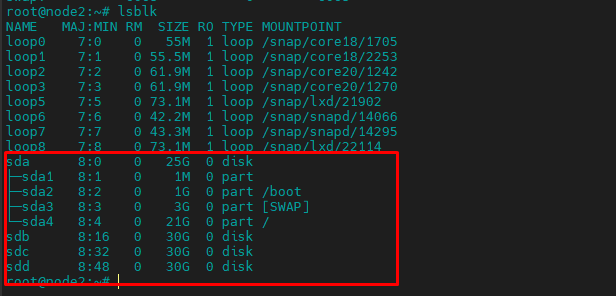
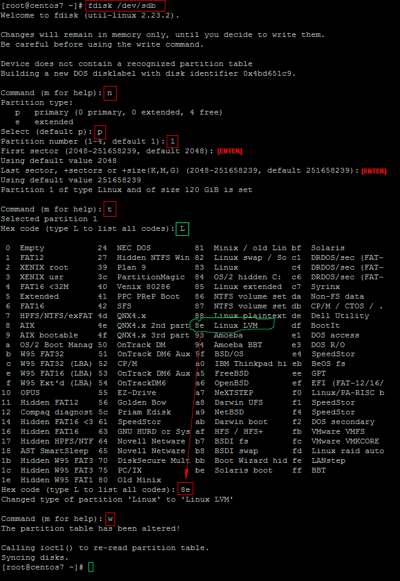
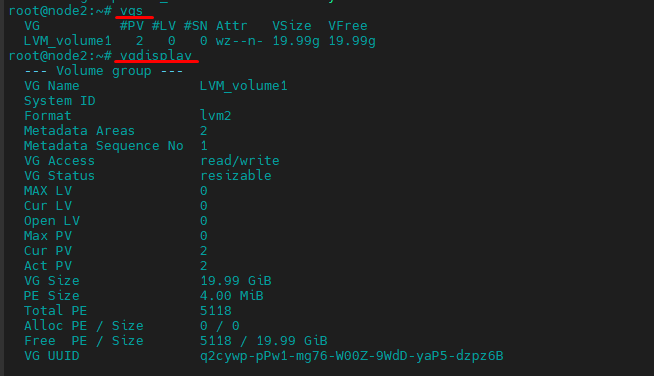
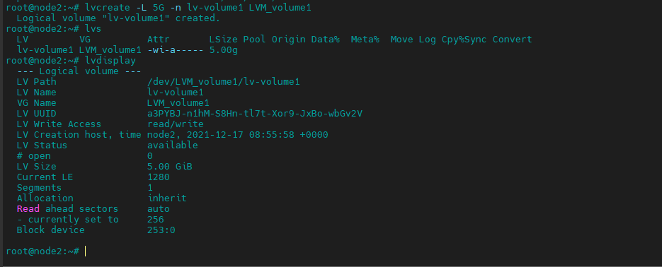
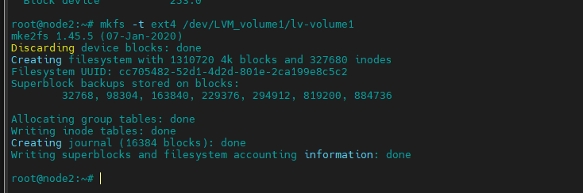
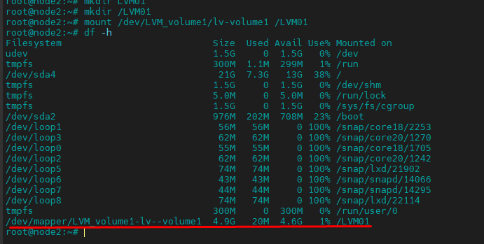
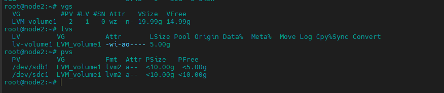
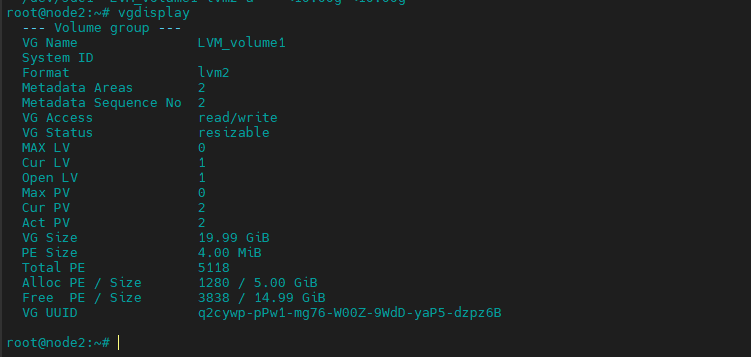

<h1 align="center">Thác tác cơ bản trên LVM</h1>

# Phần I. Chuẩn bị
- thiết lập chuẩn bị 1 VM có thông số cấu hình như sau:
  - OS: Ubuntu 20.04
  - RAM: 3GB
  - CPU: 3 Core
  - Disk: 
    - OS: 25 GB
    - Disk 1: 30GB
    - Disk 2: 30GB
    - Disk 3: 30GB

 
<h3 align="center"></h3>

# Phần II: Tạo Logical Volume trên LVM

## 1. Tạo Partition

```
fdisk /dev/sdb
```

- Nhập `n` để tạo phân vùng mới sẽ nhắc bạn chỉ định cho một phân vùng chính hoặc phân vùng mở rộng. Nhập `p` cho phân vùng chính hoặc `e` cho phân vùng mở rộng.

```
Command (m for help): n
Partition type:
   p   primary (0 primary, 0 extended, 4 free)
   e   extended
Select (default p): p
```
- Sau đó, bạn sẽ được nhắc nhập số của phân vùng sẽ được tạo. Bạn có thể nhấn Enter để chấp nhận mặc định.
```
Partition number (1-4, default 1): 1
```

- Sau đó, bạn sẽ được nhắc nhập kích thước của phân vùng sẽ được tạo ví dụ dưới chúng ta sẽ tạo đĩa với size 5GB. Bạn có thể nhấn `Enter` để sử dụng tất cả không gian có sẵn.

```
First sector (2048-33554431, default 2048): ` gõ Enter`
Last sector, +sectors or +size{K,M,G} (2048-33554431, default 33554431): ` 10002400 ` // giá trị disk 
Partition 1 of type Linux and of size 4 MiB is set
```
- Lựa chọn định dạng LVM cho disk
  - chọn `t` để thay đổi định dạng phân vùng disk vừa khởi tạo

  ```
  Command (m for help): t
  selected Partition 1
  ```
  sau đó bấm `L` và gõ `8e` để chọn định dạng `Linux LVM`

- Chạy lệnh  `w` để lưu các thay đổi.
```
Command (m for help): w
The partition table has been altered!

Calling ioctl() to re-read partition table.
Syncing disks.
```

Hình ảnh minh họa:

<h3 align="center"></h3>

## 2. Tạo Physical Volume

- Tạo các Physical Volume : /dev/sdb1 và /dev/sdc1
```sh 
pvcreate /dev/sdb1 /dev/sdc1
#hoặc
pvcreate /dev/sdb1
pvcreate /dev/sdc1
```

kết quả: 
```sh
root@node2:~# pvcreate /dev/sdb1 /dev/sdc1
  Physical volume "/dev/sdb1" successfully created.
  Physical volume "/dev/sdc1" successfully created.
root@node2:~#
```

## 3. Tạo  Volume Group

- Nhóm nhiều Physical Volume thành 1 Volume Group bằng

```sh
vgcreate LVM_volume1 /dev/sdb1 /dev/sdc1
```

kiểm tra Volume 
```sh
vgs
vgdisplay
```
<h3 align="center"></h3>

## 4. Tạo Logical Volume
### 4.1 khởi tạo với dung lượng chỉ định
- từ 1 Volume Group có thể thực hiện tạo 1 hoặc nhiều Logical Volume với mức dung lượng chỉ định
```sh
lvcreate -L 5G -n lv-volume1 LVM_volume1
```
trong đó: 
  - `-L`: Dung lượng của Logical Volume cần tạo
  - `-n`: Tên Logical Volume, ở đây là **lv-volume1**
  - `LVM_volume1`: Volume Group được sử dụng để tạo Logical Volume

```sh
root@node2:~# lvcreate -L 5G -n lv-volume1 LVM_volume1
  Logical volume "lv-volume1" created.
root@node2:~#
```
kiểm tra:
<h3 align="center"></h3>

### 4.2 khởi tạo Logical Volume với toàn bộ dung lượng vốn có

```sh
lvcreate -l 100%FREE -n lv-volume1 LVM_volume1
```

## 5. Định dạng Logical Volume
```sh
mkfs -t ext4 /dev/LVM_volume1/lv-volume1
```
<h3 align="center"></h3>


## 6. Mount và đưa vào sử dụng

```sh
mkdir /LVM01
```

- thực hiện mount Logical Volume vào thư mục vừa khởi tạo
```sh
mount /dev/LVM_volume1/lv-volume1 /LVM01
```

Kiểm tra lại dung lượng
<h3 align="center"></h3>


# Phần II. Thao tác cơ bản Logical Volume trên LVM
## 1. Kiểm tra toàn bộ
```sh
vgs
lvs
pvs
```

<h3 align="center"></h3>

## 2. Kiểm tra dung lượng Volume Group
```sh
vgdisplay
```
<h3 align="center"></h3>

## 3. Tăng kích thước Logical Volume

- sử dụng câu lệnh sau đầy để tăng kịch thước Logical Volume

```sh
lvextend -L +3G /dev/LVM_volume1/lv-volume1
```
trong đó:
  - `-L +3G`: Dung lượng cần tăng thêm
  - `/dev/LVM_volume1/lv-volume1`: Logical Volume cần tăng dung lượng


Kiểm tra lại
```sh
lvs
```

> Kích thước cho Logical Volume thì Logical Volume đã được tăng nhưng file system trên volume này vẫn chưa thay đổi, sử dụng lệnh sau:
```sh
resize2fs /dev/LVM_volume1/lv-volume1
```

## 4. Giảm kích thước Logical Volume

- Tiến hành giảm kích thước của Logical Volume
```sh
lvreduce -L 2G /dev/LVM_volume1/lv-volume1
```
- Tiến hành format lại Logical Volume
```sh
mkfs.ext4 /dev/LVM_volume1/lv-volume1
```

- Mount lại Logical Volume
```sh
mount /dev/LVM_volume1/lv-volume1 /LVM01
```


# Phần III. Thao tác cơ bản Volume Group trên LVM

- Việc thay đổi kích thước của Volume Group chính là việc nhóm thêm Physical Volume hay thu hồi Physical Volume ra khỏi Volume Group

## 1. Kiểm tra các partition và Volume Group
```sh
vgs
lsblk
```

## 2. Thêm partition vào Volume Group

- Thêm 1 partition vào Volume Group như sau:
```sh
vgextend /dev/VG1 /dev/sdc1
```
ket qua:
```sh
[root@masterkvm7101 ~]# vgextend /dev/VG1 /dev/sdc1
WARNING: ext4 signature detected on /dev/sdc1 at offset 1080. Wipe it? [y/n]: y
  Wiping ext4 signature on /dev/sdc1.
  Physical volume "/dev/sdc1" successfully created.
  Volume group "VG1" successfully extended
[root@masterkvm7101 ~]#
```

Kiểm tra
```sh
[root@masterkvm7101 ~]# vgs
  VG     #PV #LV #SN Attr   VSize    VFree
  VG1      3   1   0 wz--n-    1.09t 446.62g
  centos   1   1   0 wz--n- <214.00g      0
[root@masterkvm7101 ~]#
```

## 3. Xóa partition ra khỏi Volume Group

- thực hiện câu lệnh sau:
```sh
vgreduce /dev/VG1 /dev/sdc1
```


# Phần IV. Xóa Logical Volume, Volume Group, Physical Volume
> Trước tiên cần phải Umount Logical Volume

```sh
umount /dev/VG1/VPS1
```

## 1. Xóa Logical Volume
```sh
lvremove /dev/VG1/VPS1
```

## 2. Xóa Volume Group


- Trước khi xóa Volume Group, chúng ta phải xóa hết Logical Volume
```sh
vgremove /dev/VG1
```

## 3. Xóa Physical Volume


```sh
pvremove /dev/sdb1
```