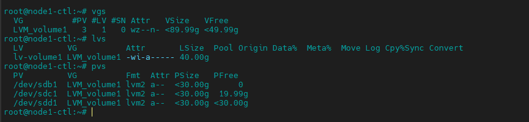
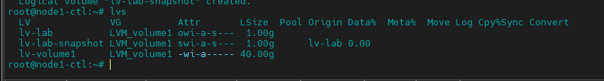
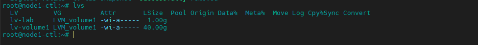
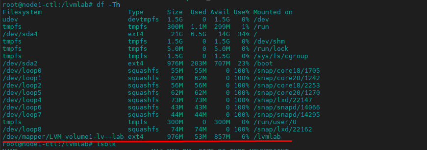
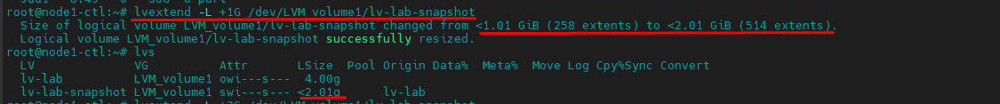

<h1 align="center">LVM Snapshot</h1>

# I. Giới thiệu

-  LVM Snapshot là tính năng cho phép backup phân vùng ổ cứng được chọn tức thời mà không làm gián đoạn các dịch vụ đang chạy.

- Những thay đổi được thực hiện sau khi Snapshort thì tính năng snapshort sẽ tạo ra 1 bản backup và cho phép khôi phục khi cần thiết

# II. Cách tạo Snapshot

- Kiểm tra cấu hỉnh

```sh
vgs
lvs
pvs
```
<h3 align="center"></h3>

- Tạo Logical Volumes

```sh
root@node1-ctl:~# lvcreate -L 1G -n lv-lab LVM_volume1
  Logical volume "lv-lab" created.
root@node1-ctl:~#
```

- Tạo Snapshot cho Logical Volumes vừa tạo
```sh
root@node1-ctl:~# lvcreate -L 1GB -s -n lv-lab-snapshot /dev/LVM_volume1/lv-lab
  Logical volume "lv-lab-snapshot" created.
root@node1-ctl:~#
```
trong đó:
-  Cú pháp: lvcreate -L [size] -s -n [tên Snapshot] [Logical Volumes cần Snapshot]
- `-s`: Tạo Snapshot
- `-n`: Tên bản snapshot

Kiểm tra :
<h3 align="center"></h3>

- Xóa Snapshot
```sh
root@node1-ctl:~# lvremove /dev/LVM_volume1/lv-lab-snapshot
Do you really want to remove and DISCARD active logical volume LVM_volume1/lv-lab-snapshot? [y/n]: y
  Logical volume "lv-lab-snapshot" successfully removed
root@node1-ctl:~#
```

Kiểm tra :
<h3 align="center"></h3>


# III. Kiểm tra hoạt động Snapshot


- cấu hình định dạng và mount thư mục OS
```sh
mkfs -t ext4 /dev/LVM_volume1/lv-lab
mkdir /lvmlab
mount /dev/LVM_volume1/lv-lab /lvmlab
```
- thêm dữ liệu vào Logical Volumes bằng cách tạo file có dung lượng
```sh
dd if=/dev/mapper/LVM_volume1-lv--lab of=upload_test bs=50M count=1
```

- kiểm tra 

<h3 align="center"></h3>


```sh
root@node1-ctl:/lvmlab# lvs
  LV              VG          Attr       LSize  Pool Origin Data%  Meta%  Move Log Cpy%Sync Convert
  lv-lab          LVM_volume1 owi-aos---  1.00g
  lv-lab-snapshot LVM_volume1 swi-a-s---  1.00g      lv-lab 9.67
  lv-volume1      LVM_volume1 -wi-a----- 40.00g
root@node1-ctl:/lvmlab# pvs
```
> khi dữ liệu thay đổi , dung lượn file snapshot sẽ thay đổi theo

- Nếu LVM bị đầy, snapshot sẽ tự động xóa


# IV. Mở rộng Snapshot LVM

- Nếu cần mở rộng kích thước Snapshot thực hiện lệnh sau:
```sh
lvextend -L +1G /dev/LVM_volume1/lv-lab-snapshot
```

<h3 align="center"></h3>