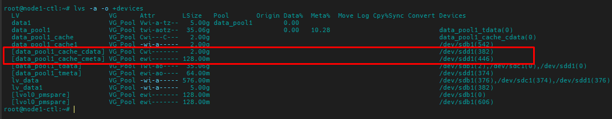

<h1 align="center">Cache Volume</h1>

# Phân I. Giới thiệu
- Loại cache logical volume sử dụng LV nhỏ nằm trong phân vùng có tốc độ truy vấn nhanh (SSD), nâng cao hiệu năng LV nằm trên phân vùng lớn, chậm hơn (Hdd).
- Thực hiện phương pháp bằng cách lưu các block thường xuyên được sử dụng trên LV có tốc độ truy cập nhanh.

- Do yêu cầu từ dm-cache (kernel driver), LVM chia cache pool LV thành 2 phần:
  - Cache data LV
  - Cache metadata LV

- Ý tưởng:
  - Tạo 1 Cache LV, 1 Cache meta LV trên SSD.
  - Sử dụng 2 phân vùng trên tạo cache pool logical volume, thêm Cache pool vào LV có tốc độ truy vấn chậm

- Thuật ngữ
  - `Cache data logical volume` - logical volume chứa data blocks của cache pool logical volume
  - `Cache metadata logical volume` - logical volume chứa metadata của cache pool logical volume, giữ thông tin nơi mà các khối dữ liệu được lưu trữ (for example, on the origin logical volume or the cache data logical volume).
  - `Cache logical volume` - logical volume chứa origin logical volume và cache pool logical volume. Đây là thiết bị sử dụng đóng gói các cache volume component khác nhau.


# Phần II. Cấu hình
- Kiểm tra cấu hình hiện tại
```sh
lvs
vgs
pvs
```
```sh
root@node1-ctl:~# lvs
  LV         VG      Attr       LSize   Pool       Origin Data%  Meta%  Move Log Cpy%Sync Convert
  data1      VG_Pool Vwi-a-tz--   5.00g data_pool1        0.00
  data_pool1 VG_Pool twi-aotz--  35.06g                   0.00   10.28
  lv_data    VG_Pool -wi-a----- 576.00m
  lv_data1   VG_Pool -wi-a-----   5.00g
root@node1-ctl:~# vgs
  VG      #PV #LV #SN Attr   VSize   VFree
  VG_Pool   3   4   0 wz--n- <89.91g <49.16g
root@node1-ctl:~# pvs
  PV         VG      Fmt  Attr PSize   PFree
  /dev/sdb1  VG_Pool lvm2 a--  <29.97g 13.03g
  /dev/sdc1  VG_Pool lvm2 a--  <29.97g 18.09g
  /dev/sdd1  VG_Pool lvm2 a--  <29.97g 18.03g
root@node1-ctl:~#
```


## 1. Khởi tạo cache pool logical volume

- thực hiện khởi tạo cache data logical volume
```sh
root@node1-ctl:~# lvcreate -L 2G -n data_pool1_cache VG_Pool /dev/sdd1
  Logical volume "data_pool1_cache" created.
root@node1-ctl:~#
```


trong đó:
  - `-L 2G`: dung lượng cache data logical volume
  - `data_pool1_cache`: tên cache data logical volume
  - `VG_Pool`: Group volume sử dụng để khởi tạo cache data logical volume
  - `/dev/sdd1`: Ổ cứng lựa chọn chỉ định khởi tạo cache data logical volume

- thông thường thì cache data logical volume có dụng lượng rất lơn

## 2. Khởi tạo cache metadata logical volume

- tỷ lệ kích thước giữa  cache pool logical volume và cache metadata logical volume là khoảng `1000:1`, với kích thước tối thiểu là 8M

```sh
root@node1-ctl:~# lvcreate -L 100M -n data_pool1_cache_meta VG_Pool /dev/sdd1
  Rounding up size to full physical extent 128.00 MiB
  Logical volume "data_pool1_cache_meta" created.
root@node1-ctl:~#
```


## 3. Tạo cache pool logical volume

```sh
root@node1-ctl:~# lvconvert --type cache-pool --cachemode writethrough --poolmetadata VG_Pool/data_pool1_cache_meta VG_Pool/data_pool1_cache
  WARNING: Converting VG_Pool/data_pool1_cache and VG_Pool/data_pool1_cache_meta to cache pools data and metadata volumes with metadata wiping.
  THIS WILL DESTROY CONTENT OF LOGICAL VOLUME (filesystem etc.)
Do you really want to convert VG_Pool/data_pool1_cache and VG_Pool/data_pool1_cache_meta? [y/n]: y
  Converted VG_Pool/data_pool1_cache and VG_Pool/data_pool1_cache_meta to cache pool.
root@node1-ctl:~#
```

- cache pool logical volume là sự kết hợp giữa cache data logical volume và cache data meta logical volume

- Sau khi hoàn thành khởi tạo Pool cache 2 volume sẽ bị ẩn đi

- kiểm tra:
```sh
lvs -a -o +devices
```

<h3 align="center"></h3>


## 4. Kết hợp cache pool logical volume với origin logical volume


```sh
root@node1-ctl:~# lvconvert --type cache --cachepool VG_Pool/data_pool1_cache VG_Pool//data_pool1
Do you want wipe existing metadata of cache pool VG_Pool/data_pool1_cache? [y/n]: y
  WARNING: thin pool data will not be automatically extended when cached.
  WARNING: manual splitcache is required before extending thin pool data.
  Logical volume VG_Pool/data_pool1_tdata is now cached.
root@node1-ctl:~#
```
- Kiểm tra:
```sh
lvs -a -o +devices
```

<h3 align="center"></h3>

# Tài liệu hướng dẫn
- https://github.com/lacoski/khoa-luan/blob/master/LVM/lvm-cache.md