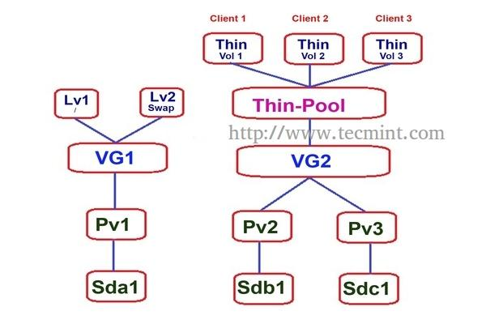

<h1 align="center">Thinly-provisioned logical volumes</h1>

# I. Giới thiệu
- **`Thinly-provisioned logical volumes `**: hỗ trợ cung cấp Logical Volume động. Cho phép tạo ra những  Logical Volume có dung lượng lớn hơn mức cần thiết mà không tiêu tốn tài nguyên hệ thống ở thời điểm khởi tạo
- Thinly-provisioning hỗ trợ quản lý dung lượng trống trên Storage Pool, có khả năng cấp phát tài nguyên tùy ý cho thiết bị khi cần thiết. Có thể tạo ra các thiết bị bên trong thin pool, tài nguyễn sẽ được cấp phát thực sự khi ứng dụng thiết bị ghi dữ liệu vào logical volume

- Ví dụ: khi có 1 user cần cấp phát 100GB thì Storage administrator có thể cấp phát ngay cả khi dung lượng Storage pool nhỏ hơn 100GB, trường hợp này được gọi là **`Over Provisioning`**


# II. Cấu trúc

<h3 align="center"></h3>


# III. Thiết lập Thin Pool và Volumes
## Tạo Volume Group
```sh
pvcreate /dev/sdb1 /dev/sdc1 /dev/sdd1
```

- Kiểm tra thông số:
```sh
root@node1-ctl:~# pvs
  PV         VG          Fmt  Attr PSize   PFree
  /dev/sdb1  LVM_volume1 lvm2 a--  <30.00g <30.00g
  /dev/sdc1  LVM_volume1 lvm2 a--  <30.00g <30.00g
  /dev/sdd1  LVM_volume1 lvm2 a--  <30.00g <30.00g
root@node1-ctl:~#
```

## Tạo Thin Pool
```sh
root@node1-ctl:~# lvcreate -L 35G --thinpool data_pool LVM_volume1
  Thin pool volume with chunk size 64.00 KiB can address at most 15.81 TiB of data.
  Logical volume "data_pool" created.
root@node1-ctl:~#
```
trong đó:
  - `-L`: kích thước volume group
  - `--thinpool`: tạo Thin Pool
  - `data_pool`: Tên Thin Pool
  - `LVM_volume1`: Volume group sử dụng lưu trữ thinpool

- Kiểm tra thông số thin Pool

```sh
lvs
lvdisplay LVM_volume1/data_pool
```
```sh
root@node1-ctl:~# lvs
  LV        VG          Attr       LSize  Pool Origin Data%  Meta%  Move Log Cpy%Sync Convert
  data_pool LVM_volume1 twi-a-tz-- 35.00g             0.00   10.47
root@node1-ctl:~# lvdisplay LVM_volume1/data_pool
  --- Logical volume ---
  LV Name                data_pool
  VG Name                LVM_volume1
  LV UUID                YUGq26-HRUe-MHRV-A0Wx-5NJS-kEtM-hE4NFc
  LV Write Access        read/write
  LV Creation host, time node1-ctl, 2022-01-13 02:31:07 +0000
  LV Pool metadata       data_pool_tmeta
  LV Pool data           data_pool_tdata
  LV Status              available
  # open                 0
  LV Size                35.00 GiB
  Allocated pool data    0.00%
  Allocated metadata     10.47%
  Current LE             8960
  Segments               1
  Allocation             inherit
  Read ahead sectors     auto
  - currently set to     256
  Block device           253:2

root@node1-ctl:~#
```

## Tạo Thin Volumes

-  Khởi tạo Thin Volmue bên trong thin Pool vừa tạo
```sh
root@node1-ctl:~# lvcreate -V 5G --thin -n thin_vol_1 LVM_volume1/data_pool
  Logical volume "thin_vol_2" created.
root@node1-ctl:~#
```

- kiểm tra các Thin Volume vừa khởi tạo
```sh
root@node1-ctl:~# lvs
  LV         VG          Attr       LSize  Pool      Origin Data%  Meta%  Move Log Cpy%Sync Convert
  data_pool  LVM_volume1 twi-aotz-- 35.00g                  0.00   10.50
  thin_vol_1 LVM_volume1 Vwi-a-tz--  5.00g data_pool        0.00
  thin_vol_2 LVM_volume1 Vwi-a-tz--  5.00g data_pool        0.00
  thin_vol_3 LVM_volume1 Vwi-a-tz--  5.00g data_pool        0.00
root@node1-ctl:~#
```

## Tạo File System

- Tạo các thư mục cho các thin volume vừa khởi tạo

```sh
mkdir -p /data-pool/Thin-volume1 /data-pool/Thin-volume2
```

- Định dang FS cho volume
```sh
mkfs.ext4 /dev/LVM_volume1/thin_vol_1
mkfs.ext4 /dev/LVM_volume1/thin_vol_2
mkfs.ext4 /dev/LVM_volume1/thin_vol_3
```

- Mount các Thin Volume vào các thư mục vừa tạo
```sh
mount /dev/LVM_volume1/thin_vol_1 /data-pool/Thin-volume1
mount /dev/LVM_volume1/thin_vol_2 /data-pool/Thin-volume2
mount /dev/LVM_volume1/thin_vol_3 /data-pool/Thin-volume3
```

- Kiểm tra:
```sh
root@node1-ctl:~# df -h
Filesystem                          Size  Used Avail Use% Mounted on
udev                                1.5G     0  1.5G   0% /dev
tmpfs                               299M  1.1M  298M   1% /run
/dev/sda4                            21G   15G  5.0G  75% /
tmpfs                               1.5G     0  1.5G   0% /dev/shm
tmpfs                               5.0M     0  5.0M   0% /run/lock
tmpfs                               1.5G     0  1.5G   0% /sys/fs/cgroup
/dev/sda2                           976M  205M  705M  23% /boot
/dev/loop1                           56M   56M     0 100% /snap/core18/2284
/dev/loop2                           62M   62M     0 100% /snap/core20/1270
/dev/loop3                           73M   73M     0 100% /snap/lxd/22147
/dev/loop0                           56M   56M     0 100% /snap/core18/2253
/dev/loop4                           62M   62M     0 100% /snap/core20/1242
/dev/loop5                           44M   44M     0 100% /snap/snapd/14295
/dev/loop7                           74M   74M     0 100% /snap/lxd/22162
/dev/loop6                           43M   43M     0 100% /snap/snapd/14066
tmpfs                               299M     0  299M   0% /run/user/0
/dev/mapper/LVM_volume1-thin_vol_1  4.9G   20M  4.6G   1% /data-pool/Thin-volume1
/dev/mapper/LVM_volume1-thin_vol_2  4.9G   20M  4.6G   1% /data-pool/Thin-volume2
/dev/mapper/LVM_volume1-thin_vol_3  4.9G   20M  4.6G   1% /data-pool/Thin-volume3
root@node1-ctl:~#
```

- Tạo dữ liệu test và kiểm tra trên cả 3 thin volume 
```sh
dd if=/dev/mapper/LVM_volume1-thin_vol_1 of=data_thinvl bs=2G count=1
```

```sh
root@node1-ctl:~# df -h
Filesystem                          Size  Used Avail Use% Mounted on
udev                                1.5G     0  1.5G   0% /dev
tmpfs                               299M  1.1M  298M   1% /run
/dev/sda4                            21G   15G  5.0G  75% /
tmpfs                               1.5G     0  1.5G   0% /dev/shm
tmpfs                               5.0M     0  5.0M   0% /run/lock
tmpfs                               1.5G     0  1.5G   0% /sys/fs/cgroup
/dev/sda2                           976M  205M  705M  23% /boot
/dev/loop1                           56M   56M     0 100% /snap/core18/2284
/dev/loop2                           62M   62M     0 100% /snap/core20/1270
/dev/loop3                           73M   73M     0 100% /snap/lxd/22147
/dev/loop0                           56M   56M     0 100% /snap/core18/2253
/dev/loop4                           62M   62M     0 100% /snap/core20/1242
/dev/loop5                           44M   44M     0 100% /snap/snapd/14295
/dev/loop7                           74M   74M     0 100% /snap/lxd/22162
/dev/loop6                           43M   43M     0 100% /snap/snapd/14066
tmpfs                               299M     0  299M   0% /run/user/0
/dev/mapper/LVM_volume1-thin_vol_1  4.9G  2.1G  2.6G  44% /data-pool/Thin-volume1
/dev/mapper/LVM_volume1-thin_vol_2  4.9G  1.1G  3.6G  23% /data-pool/Thin-volume2
/dev/mapper/LVM_volume1-thin_vol_3  4.9G  2.1G  2.6G  44% /data-pool/Thin-volume3
root@node1-ctl:~#
```
```sh
root@node1-ctl:~#lvs
  LV         VG          Attr       LSize  Pool      Origin Data%  Meta%  Move Log Cpy%Sync Convert
  data_pool  LVM_volume1 twi-aotz-- 35.00g                  15.52  18.16
  thin_vol_1 LVM_volume1 Vwi-aotz--  5.00g data_pool        42.88
  thin_vol_2 LVM_volume1 Vwi-aotz--  5.00g data_pool        22.88
  thin_vol_3 LVM_volume1 Vwi-aotz--  5.00g data_pool        42.88
root@node1-ctl:~# lvdisplay LVM_volume1/data_pool
  --- Logical volume ---
  LV Name                data_pool
  VG Name                LVM_volume1
  LV UUID                YUGq26-HRUe-MHRV-A0Wx-5NJS-kEtM-hE4NFc
  LV Write Access        read/write (activated read only)
  LV Creation host, time node1-ctl, 2022-01-13 02:31:07 +0000
  LV Pool metadata       data_pool_tmeta
  LV Pool data           data_pool_tdata
  LV Status              available
  # open                 4
  LV Size                35.00 GiB
  Allocated pool data    15.52%
  Allocated metadata     18.16%
  Current LE             8960
  Segments               1
  Allocation             inherit
  Read ahead sectors     auto
  - currently set to     256
  Block device           253:2

root@node1-ctl:~#
```

> Mỗi Thin volume đều có % và dung lượng sử dụng tương tự như Thin Pool

# III. Over Provisioning

- Cấp phát Thin Volume vượt mức giới hạn thực tế

- Khởi tạo 1 Thin volume có mức dung lượng là 25GB
```sh
root@node1-ctl:~# lvcreate -V 25G --thin -n thin_vol_4 LVM_volume1/data_pool
  WARNING: Sum of all thin volume sizes (40.00 GiB) exceeds the size of thin pool LVM_volume1/data_pool (35.00 GiB).
  WARNING: You have not turned on protection against thin pools running out of space.
  WARNING: Set activation/thin_pool_autoextend_threshold below 100 to trigger automatic extension of thin pools before they get full.
  Logical volume "thin_vol_4" created.
root@node1-ctl:~#

```

- Kiểm tra thông số cấp phát
```sh
root@node1-ctl:~# lvs
  LV         VG          Attr       LSize  Pool      Origin Data%  Meta%  Move Log Cpy%Sync Convert
  data_pool  LVM_volume1 twi-aotz-- 35.00g                  15.52  18.17
  thin_vol_1 LVM_volume1 Vwi-aotz--  5.00g data_pool        42.88
  thin_vol_2 LVM_volume1 Vwi-aotz--  5.00g data_pool        22.88
  thin_vol_3 LVM_volume1 Vwi-aotz--  5.00g data_pool        42.88
  thin_vol_4 LVM_volume1 Vwi-a-tz-- 25.00g data_pool        0.00
root@node1-ctl:~#
```

# IV. Mở rộng thin-pool
```sh
root@node1-ctl:~# lvextend -L +10G /dev/LVM_volume1/data_pool
  Rounding size to boundary between physical extents: 48.00 MiB.
  WARNING: Sum of all thin volume sizes (40.00 GiB) exceeds the size of thin pools (35.00 GiB).
  WARNING: You have not turned on protection against thin pools running out of space.
  WARNING: Set activation/thin_pool_autoextend_threshold below 100 to trigger automatic extension of thin pools before they get full.
  Size of logical volume LVM_volume1/data_pool_tmeta changed from 36.00 MiB (9 extents) to 48.00 MiB (12 extents).
  Size of logical volume LVM_volume1/data_pool_tdata changed from 35.00 GiB (8960 extents) to 45.00 GiB (11520 extents).
  Logical volume LVM_volume1/data_pool_tdata successfully resized.
root@node1-ctl:~#
```

- kiểm tra :
```sh
root@node1-ctl:~# lvs
  LV         VG          Attr       LSize  Pool      Origin Data%  Meta%  Move Log Cpy%Sync Convert
  data_pool  LVM_volume1 twi-aotz-- 45.00g                  12.07  16.21
  thin_vol_1 LVM_volume1 Vwi-aotz--  5.00g data_pool        42.88
  thin_vol_2 LVM_volume1 Vwi-aotz--  5.00g data_pool        22.88
  thin_vol_3 LVM_volume1 Vwi-aotz--  5.00g data_pool        42.88
  thin_vol_4 LVM_volume1 Vwi-a-tz-- 25.00g data_pool        0.00
root@node1-ctl:~#

```

# Tài liệu tham khảo:
- https://www.tecmint.com/setup-thin-provisioning-volumes-in-lvm/
- https://github.com/hocchudong/thuctap012017/blob/master/TVBO/docs/LVM/docs/lvm-thin.md
- https://github.com/lacoski/khoa-luan/blob/master/LVM/lvm-thin.md
