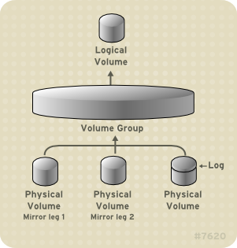

<h1 align="center">Mirrored Logical Volume</h1>

# I. Giới thiệu
- Mirroed Logical Volume hỗ trợ tạo cá bản sao lưu dữ liệu trên các thiết bị khác nhau.
- Khi dữ liệu được ghi tới 1 thiết bị, nó cũng sẽ được ghi đến 1 thiết bị khác. Phương pháp này cung cấp khả năng chịu lỗi và bảo vệ dữ liệu khi 1 thiết bị lưu trữ bị lỗi

- LVM hỗ trợ tính năng mirrored volumes. Khi tạo một mirrored logical volume thì LVM sẽ ghi dữ liệu đến vị trí mirrored trên thiết bị khác. Có thể tạo mirrored logical volume với nhiều mirrors.

- LVM mirror duy trì lượng log nhỏ, sử dụng để theo dõi phân vùng được đồng bộ với mirror (hoặc nhiều mirror)

### Tính năng
  - chuyển logical Volume từ disk này sang disk khác
  - Có thể sử dụng trên nhiều loại disk khác nhau: SATA, SSD, SAS, SAN storage iSCSI hoặc FC.
  - Migrate disk tránh lỗi, khi xảy ra lỗi sẽ không có downtime

<h3 align="center"></h3>


# Phần II. Cấu hình
## 1. Bước 1: khởi tạo Logical Volume lưu trữ dữ liệu
- Kiểm tra cấu hình Physical Volume 
```sh
root@node1-ctl:~# pvs
  PV         VG Fmt  Attr PSize   PFree
  /dev/sdb1     lvm2 ---  <30.00g <30.00g
  /dev/sdc1     lvm2 ---  <30.00g <30.00g
  /dev/sdd1     lvm2 ---  <30.00g <30.00g
root@node1-ctl:~#
```
- Sử dụng 2 ổ sdb1 và sdc1 để thực hiện lab, trong đó:
  - sdb1: Lưu trữ và khởi tạo logical volume
  - sdc1: sử dụng cấu hình mirror

- Khởi Logical Volume và cấu hình định dạng
```sh
root@node1-ctl:~# vgcreate VG_data /dev/sdb1
  Volume group "VG_data" successfully created
root@node1-ctl:~# lvcreate -L 6G -n lv_data VG_data
  Logical volume "lv_data" created.
root@node1-ctl:~# mkfs.ext4 /dev/VG_data/lv_data
mke2fs 1.45.5 (07-Jan-2020)
Discarding device blocks: done
Creating filesystem with 1572864 4k blocks and 393216 inodes
Filesystem UUID: 71266fb4-4f4d-4886-8b70-7943af016d83
Superblock backups stored on blocks:
        32768, 98304, 163840, 229376, 294912, 819200, 884736

Allocating group tables: done
Writing inode tables: done
Creating journal (16384 blocks): done
Writing superblocks and filesystem accounting information: done

root@node1-ctl:~#
```

- Mount và tạo dữ liệu
```sh
root@node1-ctl:~# mount /dev/VG_data/lv_data /data-store/data/
root@node1-ctl:~# ll /data-pool
total 16360
drwxr-xr-x  3 root root     4096 Jan 16 14:10 ./
drwxr-xr-x 24 root root     4096 Jan 13 02:50 ../
-rw-r--r--  1 root root  1921794 Jan 16 14:10 admin_pharmacy1.sql
drwx------  2 root root    16384 Jan 16 14:05 lost+found/
-rw-r--r--  1 root root 14801905 Jan 16 14:09 phpMyAdmin-5.1.1-all-languages.zip
root@node1-ctl:~#
```

- Kiểm tra :
```sh
root@node1-ctl:~# lvs
  LV      VG      Attr       LSize Pool Origin Data%  Meta%  Move Log Cpy%Sync Convert
  lv_data VG_data -wi-ao---- 6.00g
root@node1-ctl:~# vgs -o+devices
  VG      #PV #LV #SN Attr   VSize   VFree   Devices
  VG_data   1   1   0 wz--n- <30.00g <24.00g /dev/sdb1(0)
root@node1-ctl:~# pvs
  PV         VG      Fmt  Attr PSize   PFree
  /dev/sdb1  VG_data lvm2 a--  <30.00g <24.00g
  /dev/sdc1          lvm2 ---  <30.00g <30.00g
  /dev/sdd1          lvm2 ---  <30.00g <30.00g
root@node1-ctl:~#

```

## 2. Bước 2: Thêm, tạo ổ đĩa sử dụng cho tính năng mirror

- Gán thêm ổ cứng và Group Volume sư dung cho mirror
```sh
root@node1-ctl:~# vgextend VG_data /dev/sdc1
  Volume group "VG_data" successfully extended
root@node1-ctl:~# vgs
  VG      #PV #LV #SN Attr   VSize  VFree
  VG_data   2   1   0 wz--n- 59.99g 53.99g
root@node1-ctl:~#
```

- Kiểm tra trạng thái map logical volume
```sh
root@node1-ctl:~# lvs -o+devices
  LV      VG      Attr       LSize Pool Origin Data%  Meta%  Move Log Cpy%Sync Convert Devices
  lv_data VG_data -wi-ao---- 6.00g                                                     /dev/sdb1(0)
root@node1-ctl:~# dmsetup deps /dev/VG_data/lv_data
1 dependencies  : (8, 17)
root@node1-ctl:~#
```

- trong đó: (8, 17) là ảnh xạ LV tới `/dev/sdb1`

## 3. Cấu hình LVM Mirror

- Cấu hình migrate data từ LV cũ tới LV Mirror
```sh
root@node1-ctl:~# lvconvert -m 1 /dev/VG_data/lv_data /dev/sdc1
Are you sure you want to convert linear LV VG_data/lv_data to raid1 with 2 images enhancing resilience? [y/n]: y
  Logical volume VG_data/lv_data successfully converted.
root@node1-ctl:~#
```
trong đó:
  - `-m`: mirror
  - `1`: thêm 1 single mirror

- Kiểm tra cấu hình
```sh
root@node1-ctl:~# lvs -o+devices
  LV      VG      Attr       LSize Pool Origin Data%  Meta%  Move Log Cpy%Sync Convert Devices
  lv_data VG_data rwi-aor--- 6.00g                                    100.00           lv_data_rimage_0(0),lv_data_rimage_1(0)
root@node1-ctl:~#
```


- Bỏ ổ sdb1 ra khỏi logical volume
```sh
root@node1-ctl:~# lvconvert -m 0 /dev/VG_data/lv_data /dev/sdb1
Are you sure you want to convert raid1 LV VG_data/lv_data to type linear losing all resilience? [y/n]: y
  Logical volume VG_data/lv_data successfully converted.
root@node1-ctl:~#
```

- kiểm tra lại:
```sh
root@node1-ctl:~# lvs -o+devices
  LV      VG      Attr       LSize Pool Origin Data%  Meta%  Move Log Cpy%Sync Convert Devices
  lv_data VG_data -wi-ao---- 6.00g                                                     /dev/sdc1(1)
root@node1-ctl:~# dmsetup deps /dev/VG_data/lv_data
1 dependencies  : (8, 33)
root@node1-ctl:~# ll /data-pool
total 16360
drwxr-xr-x  3 root root     4096 Jan 16 14:10 ./
drwxr-xr-x 24 root root     4096 Jan 13 02:50 ../
-rw-r--r--  1 root root  1921794 Jan 16 14:10 admin_pharmacy1.sql
drwx------  2 root root    16384 Jan 16 14:05 lost+found/
-rw-r--r--  1 root root 14801905 Jan 16 14:09 phpMyAdmin-5.1.1-all-languages.zip
root@node1-ctl:~#
```

- Xóa ổ sb1 ra khởi Volume Group 
```sh
  Removed "/dev/sdb1" from volume group "VG_data"
root@node1-ctl:~#
```

- Kiểm tra lại dữ liệu 
```sh
root@node1-ctl:~# vgreduce /dev/VG_data /dev/sdb1
  Removed "/dev/sdb1" from volume group "VG_data"
root@node1-ctl:~# ll /data-pool
total 16360
drwxr-xr-x  3 root root     4096 Jan 16 14:10 ./
drwxr-xr-x 24 root root     4096 Jan 13 02:50 ../
-rw-r--r--  1 root root  1921794 Jan 16 14:10 admin_pharmacy1.sql
drwx------  2 root root    16384 Jan 16 14:05 lost+found/
-rw-r--r--  1 root root 14801905 Jan 16 14:09 phpMyAdmin-5.1.1-all-languages.zip
root@node1-ctl:~#
```


# Tài liệu tham khảo

 - https://github.com/lacoski/khoa-luan/blob/master/LVM/lvm-mirror.md