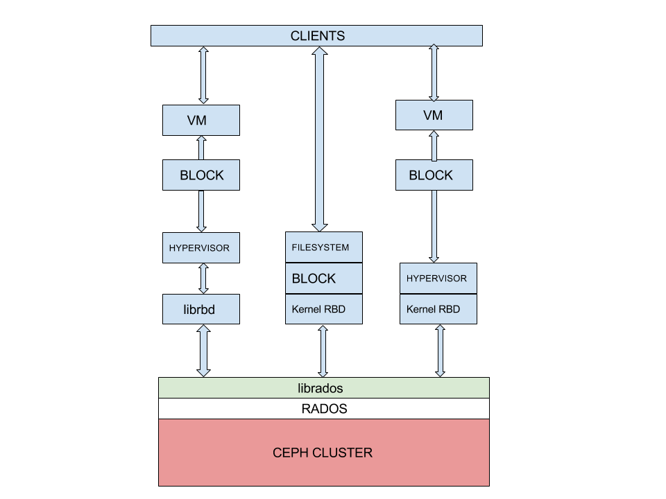
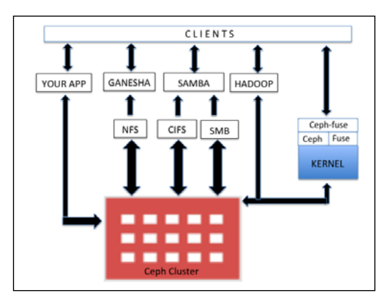

<h1 align="center">Giới thiệu về giải pháp lưu trữ CEPH</h1>

## Mục lục
- Phần I. [Giới thiệu](#gioithieu)

- Phần II. [CEPH và giải pháp](#giaiphap)

## I. Giới thiệu

<h3 align="center"></h3>

- **`CEPH`** là một project cung cấp giải pháp về Storage data. CEPH cung cấp hệ thông lưu trữ phân tán mạnh mẽ, có tính mở rộng, hiệu năng cao, khả năng chịu lỗi cao. CEPH được thiết kể  với khả năng mở rộng cao, hỗ trợ lưu trữ tới mức exabyte cùng tính tương thích cao với các phần cứng có sẵn

- Nguyên tắc cơ bản của CEPH:
  - Có thể mở rộng tất cả các thành phần
  - Khả năng chịu lỗi cao
  - Giải pháp sử dụng phần mềm mã nguồn mở, tính thích nghi cao
  - Tương thích với mọi phần cứng.

- CEPH xây dựng kiến trúc mạnh mẽ, khả năng mở rộng không giới hạn, hiệu năng cao, giải pháp thống nhất, nên tảng lưu trữ mạnh mẽ cho doanh nghiệp, cắt giảm chi phí cho các thiết bị phần cứng đắt đỏ

- Ceph cung cấp giải pháp lưu trữ dựa trên block, file, object, và cho phép tùy chỉnh theo ý muốn

- Tất cả các kiểu dữ liệu, block, file đều được lưu dưới dạng object, quản trị bởi Ceph cluster. Object storage hiện đã trở thành giải pháp cho hệ thống lưu trữ truyền thống, cho phép xây dựng kiến trúc hạ tầng độc lập với phần cứng. Tại Ceph, object sẽ không tồn tại đường dẫn vật lý, khiến obj linh hoạt khi lưu trữ, tạo nền tảng mở rộng tới hàng petabyte-exabyte.

<h3 align="center"></h3>

## II. CEPH và giải pháp

### 1. CEPH - Giải Pháp Cloud Storage

- CEPH Storage là thành phần quan trong để lưu trữ và phát triển các dịch vụ Cloud. Các giải pháp lưu trữ truyền thống gặp các vấn đề về chi phí,kiến trúc, khả năng mở rộng và nâng cấp hệ thống

- CEPH hỗ trợ rất tốt trên các nên tảng OpenStack, CloudStack, OpenNebula

### 2. CEPH - Giải Pháp Defined

- Software-defined Storage (SDS) là giải pháp hỗ trợ cắt giảm chi phí, cung cấp được các giải pháp cho khách hàng có sẵn hạ tầng lớn

### 3. CEPH - Giải Pháp Pháp Lưu Trữ Thống Nhất

- CEPH đem đến giải pháp lưu trữ thống nhất bao gồm file-based và block-based access truy cập thông qua một nền tảng. Đáp ứng tốt khả năng phát triển và tăng trưởng dữ liệu hiện tại và tương lai.
- CEPH xây dựng `true unified storage solution` gồm object,block, file storage và đồng bộ qua 1 nền tảng dựa trên phần mềm, hỗ trợ lưu trữ các luộng dữ liệu lớn, không có cấu trúc

- Tất cả block hay file storage được lưu trữ trong 1 đối tượng thông minh từ CEPH

- CPEH quản lý object,block,file storage. Object được lưu trữ riêng biệt và được hỗ trợ mở rộng không giới hạn thông qua lược bỏ metadata. Để thực hiện điều đó, ceph dùng thuật toán động để tính toán, tiềm kiếm dữ liệu và lưu trữ

<h3 align="center"></h3>

### 4. Giải Pháp Lưu Trữ Khối – Ceph Block Storage

- Lưu trữ khối là phướng thức lưu trũ truyền thống trong mạng lưu trữ (SAN). Ở phương thức này dữ liệu được lưu trữ dưới dạng các ổ ảo trên các khối và được trừu tượng hóa tại các node. Ở giải pháp khối, các ổ đĩa ảo sẽ được map tới hệ điều hành và kiểm soát đến filesystem layout.

- Giải pháp RBD (Ceph Block Device) cung cấp các ổ đĩa ảo giống với SAN. Hướng đến 1 giải pháp toàn diện RBD cung cấp sự đảm bảo, tính phân phối, hiệu năng cao trên block storage disk tại mỗi client

- RBD chia thành nhiều object, phân tán trên toàphaaEPH cluster cung cấp tính đảm bảo và hiệu năng cao. RBD hỗ trợ đến mức Linux Kennel và được tích hợp sẵn với nhân Linux Kennel, cung cấp khả năng snapshot tốc độ cao, nhẹ, copy-on-write cloning và kèm theo nhiều phương pháp. Hỗ trợ in-memory caching, nâng cao hiệu năng. Ceph RBD hỗ trợ image size tới 16EB

- Image có thể được cung cấp dưới dạng ổ đĩa ảo, máy ảo. Các công nghệ KVM,ZEN hỗ trợ đày đủ RBD và xử lý, lưu trữ trên VM. Ceph black hỗ trợ đầy đủ trên các nền tảng ảo hóa mới OpenStack, CloudStack, v.v.

<h3 align="center"></h3>

### 5. Hệ thống tệp mới – Ceph Filesystem

- Hệ thống tệp của Ceph (Ceph filesystem hay CephFS) là hệ thông tương thích mức POSIX, được sử dụng để lưu trữ dữ liệu người dùng. CEPHFS hỗ trợ tốt Linux Kennel driver cho nên tương thích hỗ trợ tốt trên nhiều nên tảng Linux OS. CEPHFS lưu trữ dữ liệu và các metadata riêng biệt, cung cấp hiệu năng và đảng bảo cho các ứng dụng đang hoạt động trên đó. Ceph cluster, Cephfslib(libcephfs) chạy trên Rados library (librados) – giao thức thuộc Ceph storage – file, block, and object storage.

> POSIX (Portable Operating System Interface) là 1 chuẩn hệ điều hành biến thể của HĐH Unix được định ra bởi IEEE Computer Society để duy trì tính tương thích giữa các hệ điều hành. Chuẩn POSIX định nghĩa API (Application Programming Interface), cùng với commandline shells và những giao diện hữu ích (utility interfaces) khác.
> - Ví dụ: Shell trên hệ điều hành  GNU/Linux có các lệnh giống trên Unix(từ tên lệnh cho đến các options, có sự khách biệt nhưng là rất ít): ls, cat, pwd, cp, mv,…
> - Unix là hệ điều hành chuẩn POSIX

- Để sự dụng CephFS cần ít nhật một Ceph metadata server (MDS) để chạy trong cụm. Khi sử dụng một MDS sẽ ảnh hưởng đến khả năng chịu lỗi của CEPH. Khi đã cấu hình MDS, client có thể sự dụng CephFS theo nhiều các khác nhau:
  -  Mount Cephfs, client sử dụng Linux Kennel hoặc ceph-fuse(filesystem in user space) driver cung cấp từ cộng động Ceph.
  - Sử dụng phần mềm thứ 3 như `Ganesha for NFS and Samba for SMB/CIFS` cho phép tương tác `libcephfs`, đảm bảo lưu trữ dữ liệu người dùng phân tán trong `Ceph storage cluster`.

- CephFS có thể sử dụng cho Apache Hadoop File System (HDFS).
- Cephfs sử fungj thư viện libcephfs để lưu trữ dữ liệu tại Ceph cluster. Các thành phần lincephfs và librados raasty linh hoạt và có thể xây dụng phiên bản tùy chỉnh 

<h3 align="center"></h3>

### 6. Giải Pháp Lưu Trữ Đối Tượng – Ceph Object Storage

- Phương pháp lưu trữ dữ liệu dưới dạng object thay vì trên các file, block truyền thống. Lưu trữ ở dạng đối tượng là giải pháp lưu trữ công nghiệp đối với nhiều đối tượng khách hàng sử dụng. Các tổ chúc muốn có giải pháp lưu trữ toàn diện đối với lượng dữ liệu lớn, từ đó Ceph đưa ra giải pháp dựa trên nền tảng lưu trữ đối tượng. CEPH phân phối và tổ chức dữ liệu hoàn toàn bằng các đối tượng và cung cấp giao diện truy cập thông qua Ceph Object gateway, chính là RADOS gateway (radosgw)

- RADOS gateway (radosgw) sử dụng librgw (the RADOS gateway library) avf librados cho phép ứng dụng thiết lập kết nối đến Ceph object storage. Ceph cung cấp giair5 pháp ổn định và có thể truy cập qau RESTful API. RADOS gateway cung cấp RESTful interface để sử dụng cho application lưu trữ dữ liệu trên Ceph storage cluster.

- Giao diện được cung cấp bởi RADOS gồm:
  - Swift compatibility: Chuẩn giao tiếp object storage của Openstack (Swift API)
  - S3 compatibility: Chuẩn giao tiếp object storage (Amazon S3 API)
  - Admin API: Giao thức quản trị ( management API, native API), có thể sử dụng trực tiếp tại ứng dụng từ đó lấy quyền truy cập vào Storage system để thực hiện công tác quản trị (management purpose)

- Có thể truy cập Ceph Object Storage system thông qua Rados gateway layer. Librados software liaries cho phép user app truy cập truwej tiếp đến CEPH bằng các ngôn ngữ C,C++,Java, Python, and PHP.

- Ceph Object Storage có khả năng cung cấp lưu trữ trên nhiều site, cung cấp giải pháp khi gặp sự cố. Việc cấu hình Object Storage có thể thực hiện bởi Rados hoặc federated gateways

<h3 align="center"></h3>

# Tài liệu tham khảo

- https://blog.devopsviet.com/2020/03/15/ceph-phan-1-tong-quan-ve-ceph/
- https://blog.devopsviet.com/2020/03/15/ceph-phan-2-cac-giai-phap-ceph/
