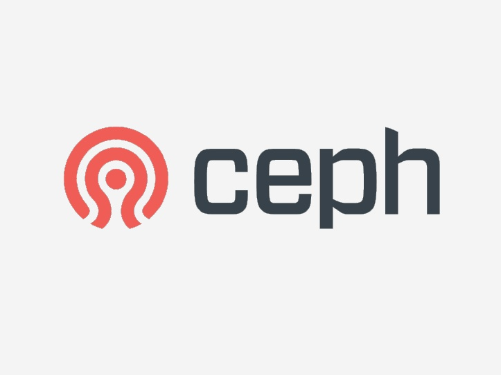
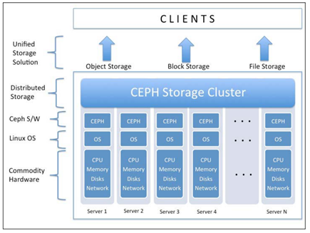

<h1 align="center">Giới thiệu về giải pháp lưu trữ CEPH</h1>

## Mục lục
- Phần I. [Giới thiệu](#gioithieu)

- Phần II. [CEPH và giải pháp](#giaiphap)

## I. Giới thiệu

<h3 align="center"></h3>

- **`CEPH`** là một project cung cấp giải pháp về Storage data. CEPH cung cấp hệ thông lưu trữ phân tán mạnh mẽ, có tính mở rộng, hiệu năng cao, khả năng chịu lỗi cao. CEPH được thiết kể  với khả năng mở rộng cao, hỗ trợ lưu trữ tới mức exabyte cùng tính tương thích cao với các phần cứng có sẵn

- Nguyên tắc cơ bản của CEPH:
  - Có thể mở rộng tất cả các thành phần
  - Khả năng chịu lỗi cao
  - Giải pháp sử dụng phần mềm mã nguồn mở, tính thích nghi cao
  - Tương thích với mọi phần cứng.

- CEPH xây dựng kiến trúc mạnh mẽ, khả năng mở rộng không giới hạn, hiệu năng cao, giải pháp thống nhất, nên tảng lưu trữ mạnh mẽ cho doanh nghiệp, cắt giảm chi phí cho các thiết bị phần cứng đắt đỏ

- Ceph cung cấp giải pháp lưu trữ dựa trên block, file, object, và cho phép tùy chỉnh theo ý muốn

- Tất cả các kiểu dữ liệu, block, file đều được lưu dưới dạng object, quản trị bởi Ceph cluster. Object storage hiện đã trở thành giải pháp cho hệ thống lưu trữ truyền thống, cho phép xây dựng kiến trúc hạ tầng độc lập với phần cứng. Tại Ceph, object sẽ không tồn tại đường dẫn vật lý, khiến obj linh hoạt khi lưu trữ, tạo nền tảng mở rộng tới hàng petabyte-exabyte.

<h3 align="center"></h3>

## II. CEPH và giải pháp

### 1. CEPH - Giải Pháp Cloud Storage

- CEPH Storage là thành phần quan trong để lưu trữ và phát triển các dịch vụ Cloud. Các giải pháp lưu trữ truyền thống gặp các vấn đề về chi phí,kiến trúc, khả năng mở rộng và nâng cấp hệ thống

- CEPH hỗ trợ rất tốt trên các nên tảng OpenStack, CloudStack, OpenNebula

### 2. CEPH - Giải Pháp Defined

- Software-defined Storage (SDS) là giải pháp hỗ trợ cắt giảm chi phí, cung cấp được các giải pháp cho khách hàng có sẵn hạ tầng lớn

### 3. CEPH - Giải Pháp Pháp Lưu Trữ Thống Nhất

- CEPH đem đến giải pháp lưu trữ thống nhất bao gồm file-based và block-based access truy cập thông qua một nền tảng. Đáp ứng tốt khả năng phát triển và tăng trưởng dữ liệu hiện tại và tương lai.
- CEPH xây dựng `true unified storage solution` gồm object,block, file storage và đồng bộ qua 1 nền tảng dựa trên phần mềm, hỗ trợ lưu trữ các luộng dữ liệu lớn, không có cấu trúc

- Tất cả block hay file storage được lưu trữ trong 1 đối tượng thông minh từ CEPH

- CPEH quản lý object,block,file storage. Object được lưu trữ riêng biệt và được hỗ trợ mở rộng không giới hạn thông qua lược bỏ metadata. Để thực hiện điều đó, ceph dùng thuật toán động để tính toán, tiềm kiếm dữ liệu và lưu trữ