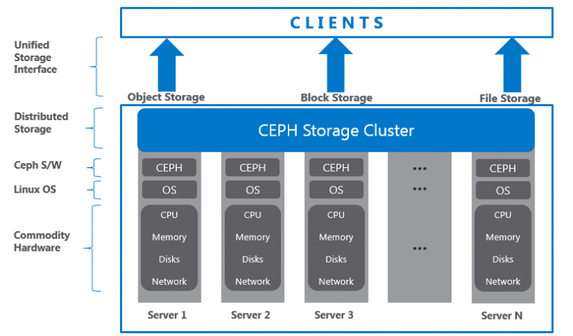
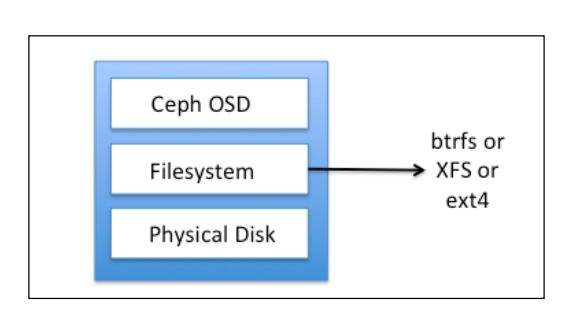
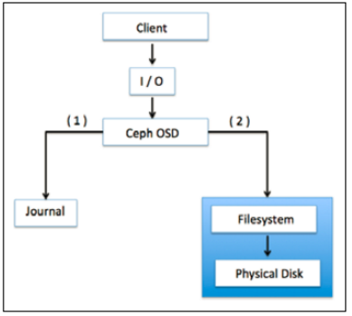

<h1 align="center">Kiến trúc và các thành phần CEPH</h1>

# Phần I. Kiến trúc CEPH

<h3 align="center"></h3>

- CEPH được xây dựng giải pháp dựa trên phần mềm Software-defined Storage (SDS), cung cấp giải pháp đáp ứng các khách hàng có hạ tâng lớn nhưng không muốn đầu tư thêm chi phí. SDS hỗ trợ tốt trên nhiều nên tảng phần cứng từ mọi nhà cung cấp, đem đến các lợi thế về giá thành, tính đảm bảo và khả năng mở rộng

- Ceph storage cluster được xây dụng từ các tiến trình . Mỗi tiến trình đều có một vai trò và giá trị sử dụng khác nhau. Đây là yếu tố để so sánh Ceph đối với các hệ thống tương tự

## 1. Lưu Trữ Phân Phối Dữ Liệu Đáng Tin Cây (RADOS)

- RADOS là yếu tố nền tảng tạo nên Ceph storage cluster. Ceph data được lưu trên object, RADOS có trách nhiệm tổ chức, lưu trữ các object. RADOS layer chắc chắn dũ liệu luôn chính xác, đảm bảo

- RADOS cung cập tính nhất quán, luôn có bản sao dữ liệu, phát hiện lỗi và khôi phục trên mọi node trong cluster. KHi ứng dụng lưu trữ tới ceph cluster, dữu liệu sẽ được lưu trữ tại Ceph Object Storage Device (OSD) dưới dạng object. Đây là thành phần duy nhất mà Ceph Cluster sử dụng để lưu trữ và truy vấn dữ liệu.
- Thông thường tổng số ổ cứng vật lý sử dụng trong Ceph cluster sẽ bằng với số lượng tiến trình OSD sử dụng để lưu trữ dữ liệu

## 2. Tiến Trình Giám Sát (Ceph Monitor – Ceph MON)

- Ceph Monitor tập trung vào trạng thái toàn cluster, giám sát trạng thái OSD,MON,PG,Crush map.Các Cluster node sẽ giám sát và chia sẻ thông tin về các thay đổi. Quá trình giám sát sẽ không lưu trữ dữ liệu. librados lib hỗ trợ truy cập RADOS thông qua PHP, Ruby, Java, Py, C/++.
- Cung cấp giao diện thân thiện với Ceph storage cluster, RADOS và các service RBD, RGW, POSIX interface trong Cephfs

> librados API hỗ trợ truy cập trực tiếp tới RADOS, cho phép nhà phát triển tạo mới giao thức tương tác với Ceph storage cluster.

## 3. Ceph Block Device Hay RADOS Block Device (RBD)

- Đây là thành phần cung cấp block storage, có thể mapped, formmatted, mounted giống như bất kỳ các disk thông thường
- Ceph block storage hỗ trợ cacs tính năng provisioning và snapshots

## 4. Ceph Object Gateway Hay RADOS Gateway (RGW)

- Thành phần cung cấp giao diện RESTful API, tương thích với Amazone S3 (Simple Storage Service) và Openstack Object Storage API (Swift)
- RGW cũng hỗ trợ Openstack keystone authencation services.

## 5. Ceph Metatdata Server ( MDS)
- Thành phần tập trung phân cấp files và lưu trữu metadata dành riêng cho Cephfs. Ceph block device và RADOS gateway không yêu cầu metadata vì chúng không cần MDS deamon. MDS không trực tiếp hỗ trợ khách hàng, vì thế loại bỏ tính lỗi đơn cho hệ thống

## 6. Ceph File system (CephFS)

- Cung cấp POSIX-compliant, phân phối filesystem
- CephFS dựa trên Ceph MDS để thể hiện tính phân cấp file, metadata.

# Phần II. Các thành phần chính
## 1. CEPH RADOS
- RADOS ( Reliable Automatic Distributed Object Storage) là trung tâm của Storage system và được gọi là Ceph Storage cluster. RADOS cung cấp các tính năng quan trọng như: phân bổ lưu trữ đối tượng, HA, bảo đảm, chịu lỗi, tự xử lý và giám sát

> RADOS layer có vai trò quan trọng bên trong kiến trực Ceph storage

- Các phương thức truy cập trên RBD,CephFS,RADOAGW,librados tất cả đều hoạt động trên RADOS layer. Khi Ceph Cluster tiếp nhận yêu cầu đọc ghi dữ liệu từ client, thuật toán CRUSH sẽ tính toán vị trí dữ liệu được lưu trữ
- Dựa trên CRUSH thì RADOS sẽ phân bổ dữ liệu đến tất cả node thuốc cluster vào trong các đối tượng, và cuối cùng các đối tượng sẽ được lưu trữ đến các OSD. RADOS có trách nhiệm tổ chức, đảm bảo khi cấu hình và có nhiều hơn 1 lần nhân bản dữ liệu

- Tại cùng thời điểm, RADOS sẽ nhận bản object và lưu trữ tại phân vùng khác. Để có mức đảm bảo cao cần tùy chỉnh tập luật của CRUSH theo yêu cầu và nền tảng hạ tầng
- Trong trường hợp có sai sót, object sẽ được khổi phục dựa trên các bản sao, tính năng khôi phục dữ liệu tự động vì Cepg rados có tính năng tự khôi phục, tự sửa lỗi

- Khi nhìn vào kiến trúc CEPH sẽ có 2 phần , RADOS là tâng dưới , nằm beentrong Ceph Cluster và không giao tiếp trực tiếp đến client, bên trên có các client interface.

## 2. Tiến Trình Lưu Trữ Đối Tượng (Ceph Object Storage Device – OSD)

- Đây là thành phần thực hiện lưu trữ dữ liệu đến đến các thiết bị lưu trữ dữ liệu vật lý tại mỗi node dưởi dạng object. Phần lớn các hoạt động lưu trữ bên trong Ceph cluster được thực hiện bởi tiến trình Ceph OSD. CEPH OSD lưu trữ dữ liệu tất cả người dùng ở dạng object và bên trong Ceph bao gồm nhiều OSD

- Yêu cầu đọc/ghi dữ liệu từ người dùng tới cluster map từ các tiến trình giám sát được điều hướng đến OSD để thực hiện đọc ghi dữ liệu, từ đó người dùng làm việc trực tiếp với OSD mà không thông qua các tiến trình giám sát, điều này làm tăng hiệu năng và tốc độ đọc ghi dữ liệu. Cơ chế " data-storage-and-retrieval mechnisim" gần như là đọc nhất khi so sánh ceph đối với các giải pháp tương tự

- Mỗi Object trong OSD đều có các phiên bản chính và bản sao năm trên các OSD khác nhau. Vì Ceph lưu trữ phân tán nên các object được lưu trữu trên nhiều OSD, mỗi một OSD sẽ chứa một bản chính và một bản phụ. khi xay ra lỗi ổ đĩa, CEPH OSD daemon sẽ tiến hành so sánh các OSD để thực hiện khôi phục

- Tại thời điểm khôi phục dữ liệu bản sao sẽ trở thành bản chính và tạo ra bản sao mới trên OSD khác trong thời điểm khôi phục. tuy nhiên OSD hỗ trợ tùy chỉnh và cho phép 1 OSD trên mỗi hót, ỏ đũa và raid volume.Hầu hết khi triển khai Ceph trong JBOD environment sẽ sử dụng mỗi OSD daemon trên mỗi ổ đĩa vật lý.

## 3. Hệ Thống Tệp Trên Ceph OSD

<h3 align="center"></h3>

- CEPH OSD bao gồm các thành phần Ceph OSD filesystem, Linux filesystem và phía trên cùng là Ceph OSD service.
- Linux filesystem có vai trò quan trọng trong tiến trình Ceph OSD như hỗ trợ extended attributes ( XATTRs).XATTRs cung cấp các thông tin nội bộ về object state, snapshot, metadata, ACL tới OSD daemon, cho phép quản trị dữ liệu.

- Hoạt động của CEPH OSD bên trên ổ đĩa vật lý có phân vùng bên trong linux partition. Linux partition có thể là Btrfs(B-tree file system), XFS hay ext4. Đối với mỗi filesysystem sẽ có một đặc điểm riêng biệt
  - Btrfs: Cung cấp hiệu năng tốt nhất khi so sánh với XFS, EXT4. Hỗ trợ các công nghệ mới nhất(copy-on-write, writable snapshots, vm provisioning, cloning). Hiện tại  Btrfs vẫn chưa ổn định trên một số nên tảng
  - XFS: Mạng lại sự tin cậy, ổ định đối với filesystem. được khuyên dùng đối với hệ thống Ceph cluster và đang được sử dụng nhiều nhất trên Ceph Storege. Nhưng vẫn có một số đặc điểm kém với Btrfs (XFS chạy chậm hơn Btrfs vì XFS thuộc loại Journaling Filesystem) và một số vấn đề về hiện suất khi mở rộng metadata
  - Ext4: Fourth Extended Filesystem, thuộc Journaling Filesystem và có hỗ trợ CEPH Storage, tuy nhiên về độ thân thiên chưa bằng XFS và hiện năng không cao bằng Btrfs.

- CEPH OSD sử dụng các thuộc tính mở rộng của FS để biết trạng thái của Object lưu trữu metadata. XATTRs cho phép lưu trữ thông tin mở rộng liên quan đến object dưới dạng xattr_name và xattr_value,cung cấp tagging objects với nhiều thông tin metadata hơn.

- Ext4 không cung cấp đầy đủ các tính năng XATTRs dẫn đến một số hạn chế về bytes lưu trữ XATTRs dẫn đến không thân thiện và tối ưu khi sử dụng cho filesystem, đồng thời Btrfs và XFS cũng hỗ trợ khả năng lưu trữ lớn hơn

## 4. Ceph OSD Journal

- Ceph sử dụng journaling filesystems như Btrfs, XFS cho OSD.
- Trước khi dữ liệu được đẩy đến backing store, Ceph ghi  dữ liệu đến một phân vùng đặc biệt gọi là `journal`. Đây là một phân vùng ảo tách biệt trên ổ đĩa HDD hay phân vùng ổ SSD, cũng có thể là một file bên trên FS. Ceph ghi tất cả tới jounal và sau đó mới lưu trữ tới backing storage.

<h3 align="center"></h3>

- `journal` có size cơ bản là 10GB, có thể to hơn tùy vào phân vùng. journal có khả năng đảm bảo và tăng tốc độ truy vấn đọc ghi dữ liệu. Hoạt động ghi ngẫu nhiên được xử lý trên bộ nhớ các `journal` sau đó được đẩy sang FS tạo điều kiện filesystem có đủ thời gian đẻ ghi dữ liệu xuống ổ đĩa.

- Hiệu suất journal được cải thiện khi thiết lập trên phân vùng SSD. tất cả các client sẽ được ghi xuống SSD journal sau đó đẩy xuống ổ đĩa. Sử dụng SSD journal cho phép OSD xử lý được khối lượng công việc lớn. tuy nhiên nếu  các journal chậm hơn Banking Store sẽ hạn chế hiệu năng của Cluster

- Sử dụng tỷ lệ 4-5 OSD trên mỗi SSD journal, nếu vượt quá có thể sẽ gây ra hiện tượng ngõ cổ chai đối với cluster

- Đối với trường hợp lỗi journal trong Btrfs-based filesystem sẽ giảm thiểu mất mát dữ liệu. Btrfs sử dụng kỹ thuật copy-on-write filesystem nên nếu nội dung `content block` thay đổi, việc ghi sẽ diễn ra riêng biệt. Trong trường hợp journal gặp lỗi, dữ liệu sẽ vẫn tồn tại.

- Không sử dụng **`RAID`** cho CEPH vì sẽ làm giảm hiệu năng ổ cứng, nó khiển việc nhân bản dữ liệu diễn ra 2 lần và chiếm tài nguyên hệ thống. Nên sử dụng Raid 0 để bảo vệ dữ liệu, Ceph sẽ chịu trách nhiệm nhân bản, tái tạo dữ liệu thay vì sử dụng mode raid khác nên chọn CEPH có hiệu năng vượt trội hơn về khả năng khôi phục nhanh hơn, giảm chi phí đầu tư phần cứng. Đối với Raid 5,6 có hiệu năng cao hơn CEPH vì tính chất random IO(thuật toán CRUSH)

## 5. Tiến Trình Giám Sát (Ceph Monitor)

- Ceph monitor có nhiệm vụ giám sát toàn bộ Cluster. Tiến trình hoạt động hoàn toàn trên cluster, giám sát thông tin, trạng thái, cấu hình. CEPH monitor hoạt động dựa trên duy trì master copy trên cluster
- Cluster map bao gồm OSD, PG, CRUSH, MDS maps

- Tất cả các map  được biết đến bên trong cluster map
  - Monitor map: Chứa thông tin về monitor node bao gồm Ceph cluster IP, monitor hostname, and IP address và port number. Nó cũng lưu trữ map creation và thông tin thay đổi cuối cùng.