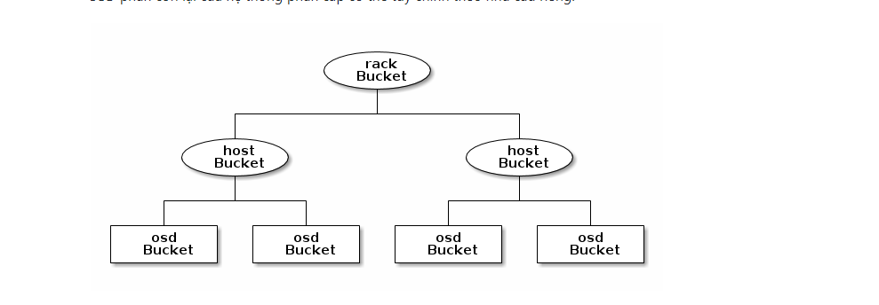

<h1 align="center">Tìm hiểu về Crush Map trong CEPH</h1>

- Thuật toán Crush xác định cho ta cách lưu trữ và truy xuất dữu liệu, bằng cách tính toán vị trí luuw trữu các dữ liệu. Crush cho phép client kết nối , truyền thông và là việc trực tiếp với OSD thay vì phả làm việc thông qua server trung gian. Với phương pháp luuw trữ và truy xuất dữ liệu CEPH tránh được 1 điểm đơn độc, giảm hiệu suất và giới hạn vật lý đối với khả năng mở rộng.

- CEPH yêu cầu bắt buộc phải có một map sử dụng để hình thành kiểu lưu trữ và truy xuất dữ liệu trong OSD và phân phối dữ liệu trong toàn cụm.CRUSH - Controlled Replication Under Scalable Hashing, thay vì lưu trữ metadata, CRUSH tính toán metadata theo yêu cầu.

- Crush map chứa danh sách các OSD, một list buckets và các quy tác cho biết các sao chép dữ liệu trong các cluster. Phản ảnh lại sơ đồ tổ chưc thiết bị vật lý cơ bản của cụm và thiết lập các quy tắc, cơ chế sao lưu dữ liệu trên các thành phần, vị trí vật lý khác nhau.
- Khi tạo một file cấu hình và deploy ceph với ceph-deploy CEPH sẽ tạo crush map mặc định cho cấu hình phù hợp với môi trường triển khai. Khi triển khai với quy mô lớn phải cân nhắc tùy chỉnh crush map việc này sẽ giúp quản lý cụm CEPH, cải thiện hiệu suất và đảm bảo an toàn dữ liệu.

- Khi một OSD bị hỏng crush sẽ giúp xác định vị trí bị lỗi và thực hiện xử lý

## 1. CRUSH LOCATION
Vị trí của một OSD theo hệ thống phân cấp của crush map được gọi là crush location, diễn tả vị trí theo kiểu key - value.
  - Thu tu key khong qua quan trong
  - Key name (bên trái dấu = ) phải là một trong các giá trị hợp lệ, mặc định bao gồm root, datacenter, room, row, pod, pdu, rack, chassis, host nhưng có thể tùy chỉnh bằng các sửa crush maps.
- Không phải tất cả các key cần phải được chỉ định, ceph tự động đặt đặt ceph osd deamon là `root=default` `host=HOSTNAME`

## 2. CEPH-CRUSH-LOCATION HOOK

Mặc định `ceph-crush-location` sẽ tạo một `CRUSH location string` cho một deamon nhất định, vị trí được dựa trên thứ tự ưu tiên (trong file ceph.conf hoặc mặc định root=default host=HOSTNAME).

Có thể quản lý crush maps thủ công bằng tay bằng cách tắt

`location hook` trong cấu hình:

```
osd crush update on start = false
```

## 3. CUSTOM LOCATION HOOKS

Có thể tùy chỉnh hook location thay cho hook chung trong cấu trúc OSD phân cấp.

```
osd crush location hook = /path/to/script
```

Hook được truyền qua bỏi một số đối số và sẽ stdout với CRUSH location.

```
ceph-crush-location --cluster CLUSTER --id ID --type TYPE
```

CLUSTER thường là ceph, id định dạnh OSD, deamon thường là osd.

## 4. EDITING A CRUSH MAP

```
1. Get the CRUSH map.
2. Decompile the CRUSH map.
3. Edit at least one of Devices, Buckets and Rules.
4. Recompile the CRUSH map.
5. Set the CRUSH map.
```

`GET A CRUSH MAP`: Xuất thông tin về cluster đang chạy với một tên chỉ định. Lúc này CRUSH maps ở dạng được biên dịch, bạn phải dịch ngược nó trước khi bạn có thể chỉnh sửa nó.

```
ceph osd getcrushmap -o {compiled-crushmap-filename}
```

`DECOMPILE A CRUSH MAP`: Biên dịch lại 1 crush map và output ra một file với tên đặc biệt.

```
crushtool -d {compiled-crushmap-filename} -o {decompiled-crushmap-filename}
```

`COMPILE A CRUSH MAP`: Thực hiện sau khi đã chỉnh sửa crush map.

```
crushtool -c {decompiled-crush-map-filename} -o {compiled-crush-map-filename}
```

`SET A CRUSH MAP`

```
ceph osd setcrushmap -i  {compiled-crushmap-filename}
```

## 5. CRUSH MAP PARAMETERS

4 thành phần chính của crush map:

- `Devices`: Bao gồm các thiết bị lưu trữ

- `Bucket Types`: Định nghĩa các kiểu của bucket được sử dụng trong hệ thống phân cấp crush. Bao gồm tập hợp các storage location (rows, racks, chassis, hosts...)

- `Bucket Instances`: Khi xác định mỗi bucket type, phải khai báo các bucket instances cho host.

- `Rules`: Bao gồm các quy tắc lựa chọn bucket.

## 6. CRUSH MAP DEVICES

Để ánh xạ tổ chức lưu trữ của các OSD, crush map bắt buộc phải có một danh sách các OSD devices (name của OSD deamon từ file CEPH config). Danh sách các devices đầu tiên xuất hiện trong crush maps. Để khai báo một devices vào trong CRUSH maps, tạo một dòng ở dưới danh sách devices, bắt buộc phải tuân thử theo cú pháp.

```
#devices
device {num} {osd.name}
```

```
# devices
device 0 osd.0 class hdd
device 1 osd.1 class hdd
device 2 osd.2 class hdd
device 3 osd.3 class hdd
device 4 osd.4 class hdd
device 5 osd.5 class hdd
device 6 osd.6 class hdd
device 7 osd.7 class hdd
device 8 osd.8 class hdd
device 9 osd.9 class hdd
device 10 osd.10 class hdd
device 11 osd.11 class hdd
```

Theo nguyên tắc 1 OSD ánh xạ tới 1 thiếu bị lưu trữ độc lập hoặc RAID.

## 7. CRUSH MAP BUCKET TYPES

Dòng thứ 2 trong CRUSH maps định nghĩa `bucket types`, bucket phân cấp node và leaves. Sử dụng trong ngữ cảnh cho một vị trí phần cứng vật lý, thường đại diện cho các vị trí vật lý trong hệ thống phân cấp.

Để thêm bucket vào trong list phải tuân thủ quy tắc.

```
#types
type {num} {bucket-name}
```

```
# types
type 0 osd
type 1 host
type 2 chassis
type 3 rack
type 4 row
type 5 pdu
type 6 pod
type 7 room
type 8 datacenter
type 9 region
type 10 root
```

## 3.3. CRUSH MAP BUCKET HIERARCHY

CRUSH là một cơ sở hạ tầng đầy đủ, nó duy trì một hệ thống phân cấp lồng nhau cho các thành phần của cơ sở hạ tầng. Danh sách thiết bị bao gồm disk, node, rack, row, switch, power circuit, room, data center. Các thành phần này đc gọi là failure zones or CRUSH buckets. CRUSH map chứa danh sách các buckets có sẵn để tổng hợp vào physical locations. NÓ cũng bao gồm danh sách các rules giúp cho CRUSH biết làm như nào để replicate data giữa các Ceph pool.

CRUSH phân phối các đôi tượng cũng như các bản sao của chúng theo sơ đồ phân cụm đã được xác định. CRUSH map đại diện cho các thiết bị lưu trữ sẵn có và các yêu tố logic.

Để ánh xạ các group tới vị trí các OSD tên các miền khác nhau, crush map xác định danh sách phân cấp các loại nhóm, các nút lá đại diện cho OSD phần còn lại của hệ thống phân cấp có thể tùy chỉnh theo nhu câu riêng.


<h3 align="center"></h3>


## 4. CRUSH MAP RULES

CRUSH map hỗ trợ các rules, đó là các quy tắc các định vị trí lưu trữ: Ví dụ như tạo bao nhiêu bản sao, replicate theo node, datacenter...

```
rule <rulename> {

        ruleset <ruleset>
        type [ replicated | erasure ]
        min_size <min-size>
        max_size <max-size>
        step take <bucket-name>
        step [choose|chooseleaf] [firstn|indep] <N> <bucket-type>
        step emit
}
```

```
# rules
rule replicated_rule {
        id 0
        type replicated
        min_size 1
        max_size 10
        step take default
        step chooseleaf firstn 0 type host
        step emit
}
```

### ruleset

```
Description: Phân lớp các rule thuộc về một bộ quy tắc
Purpose:	Một thành phần của rule.
Type:	Integer
Required:	Yes
Default:	0
```

### type

```
Description:	Mô tả quy tắc cho một thiết bị lưu trữ hoặc raid.
Purpose:	Một thành phần của rule.
Type:	String
Required:	Yes
Default:	replicated
Valid Values: replicated - erasure
```

### min_size

```
Description:	Nếu một pools tạo ra với số bản replicate ít hơn số này CRUSH sẽ không chọn rule này.
Type:	Integer
Purpose:	Một thành phần của rule.
Required:	Yes
Default:	1
```

### max_size

```
Description:	Nếu pool được tạo với số bản replicate lớn hơn số này CRUSH sẽ không chọn rule này.
Type:	Integer
Purpose:	Một thành phần của rule.
Required:	Yes
Default:	10
```

### step take

```
Description:	
Purpose:	Một thành phần của rule.
Required:	Yes
Example:	step take data
```

### step choose firstn {num} type {bucket-type}

```
Description: Chọn số bucket cho theo type bucket. Số này thường là ố bản replica của pool.

If {num} == 0, choose pool-num-replicas buckets (all available).
If {num} > 0 && < pool-num-replicas, choose that many buckets.
If {num} < 0, it means pool-num-replicas - {num}.
Purpose: Một thành phần của rule.
Prerequisite:	step take hoặc step choose.

Example: step choose firstn 1 type row
```

### step emit

```
Description: Kết quả hiện tại đổ vào đầu ra stack, thường đường sử dụng ở phần cuối của rule, nhưng cũng có thể được sử dụng từ một cây khác trong cùng rule.
Purpose:	Một thành phần của rule.
Prerequisite:	Follows step choose.
Example:	step emit
    